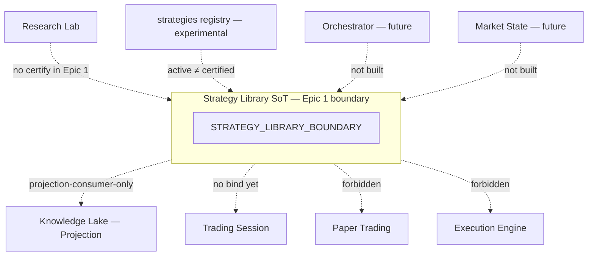

# RC-22 Epic 1 — Strategy Library Boundary Diagram

**Document:** Strategy Library Boundary Diagram  
**Status:** Epic 1 implemented — awaiting review  
**Date:** 2026-08-10  
**Parent:** [Epic 1 Report](./rc-22-epic1-strategy-library-boundary.md) · [Integration Diagram](./rc-22-strategy-library-integration.md)

---

## 1. Bounded context

```text
┌──────────────────────────────────────────────────────────────────┐
│                     STRATEGY LIBRARY (SoT)                       │
│                     moduleId: strategy-library                   │
│                                                                  │
│  Owns (declared — not implemented in Epic 1):                    │
│    • certified strategy lifecycle                                │
│    • strategy versions                                           │
│    • certification references                                    │
│    • eligibility references                                      │
│    • tactical envelope binding references                        │
│                                                                  │
│  Epic 1 activePorts: ALL false                                   │
└──────────────────────────────────────────────────────────────────┘
```

---

## 2. Ownership map

```text
                    ┌─────────────────────┐
                    │  Research Lab       │  SoT: experiments / evidence bodies
                    └──────────┬──────────┘
                               │ (later: evidence refs only)
                               ▼
┌──────────────┐    ┌─────────────────────┐    ┌─────────────────────┐
│ Strategies   │    │  STRATEGY LIBRARY   │───▶│  Knowledge Lake     │
│ registry     │    │  (certified SoT)    │    │  (Projection only)  │
│ experimental │    └──────────┬──────────┘    └─────────────────────┘
└──────────────┘               │
     ≠ certified               │ (later: eligibility / lookup)
                               ▼
                    ┌─────────────────────┐
                    │ Strategy Deployment │  SoT: binding
                    └──────────┬──────────┘
                               ▼
                    ┌─────────────────────┐
                    │ Trading Session     │  SoT: lifecycle (Bot = alias)
                    └──────────┬──────────┘
                               ▼
              Risk → Orders → Execution → Paper Adapter
                     (frozen path — unchanged)
```

---

## 3. What Library must not absorb

```text
✗ Research experiments
✗ Paper Trading product
✗ Trading Session lifecycle
✗ Knowledge Lake warehouse (Library may emit projections later; Lake never certifies)
✗ Execution / Orders / Risk / Ledger
✗ Trading Orchestrator product
✗ Market State Engine product
✗ Bot aggregate / second runtime
✗ Experimental strategies registry as certification SoT
```

---

## 4. Authority conflict rules (Epic 1)

| Dispute                         | Winner                         |
| ------------------------------- | ------------------------------ |
| Certified membership / envelope | **Strategy Library**           |
| Eligibility status              | **Strategy Library**           |
| Session lifecycle               | Trading Session                |
| Paper trading operations        | Paper path owners              |
| Execution / fills               | Execution Engine               |
| Analytical Lake facts           | Knowledge Lake (as Projection) |

---

## 5. Mermaid



---

## Approval

| Role               | Decision                    | Date |
| ------------------ | --------------------------- | ---- |
| Architecture owner | ☐ Approve ☐ Request changes |      |
| Tech lead          | ☐ Approve ☐ Request changes |      |
