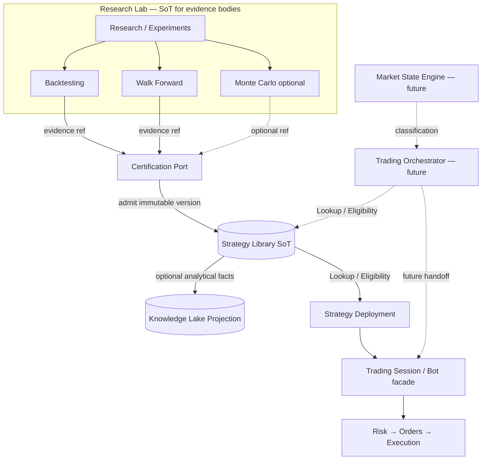

# RC-22 — Strategy Library Integration Diagram

**Document:** Strategy Library Integration (RC-22)  
**Status:** PLANNING — awaiting approval  
**Date:** 2026-08-10  
**Nature:** Architecture mapping only. No implementation.

**Parent:** [RC-22 Implementation Plan](./rc-22-implementation-plan.md)  
**Domain:** [Domain Model Contract](./rc-22-domain-model-contract.md)  
**API:** [API Contract](./rc-22-api-contract.md)  
**Epics:** [Epic Breakdown](./rc-22-epic-breakdown.md)  
**Constitution:** [Architecture Specification v2.0](./trp-architecture-specification-v2.md) §5, §6, §8  
**C4 context:** [V2 C4 Container Diagram](./v2-c4-container-diagram.md)

---

## 1. Integration principle

Strategy Library is the **Source of Truth** for certified strategy versions, envelopes, and eligibility status.

```text
Research Lab ──evidence refs──▶ Certification ──admit──▶ Strategy Library (SoT)
                                                              │
                    ┌─────────────────────────────────────────┼──────────────────────────┐
                    ▼                                         ▼                          ▼
            Lookup / Eligibility                    Knowledge Lake                Trading Session
            (Deployment bind gate)                  (Projection)                  (via Deployment)
                    │                                         ▲
                    ▼                                         │
         Trading Orchestrator (future)              optional certify/deprecate facts
         + Market State (future input)
```

**Library never executes. Lake never certifies. Orchestrator never invents envelopes.**

---

## 2. Authority classes on this diagram

| Element                   | Class                            | Role in RC-22                                   |
| ------------------------- | -------------------------------- | ----------------------------------------------- |
| Strategy Library          | **SoT**                          | Certified versions, envelopes, lifecycle status |
| Research Lab evidence     | **SoT** (Lab)                    | Artifact bodies; Library holds **refs** only    |
| Strategy registry         | **SoT** (experimental config)    | Not production eligibility                      |
| Strategy Deployment       | **SoT** (binding)                | Binds `libraryEntryId`; does not certify        |
| Trading Session           | **SoT** (lifecycle)              | Consumes certified deployment; Bot = alias      |
| Knowledge Lake            | **Projection**                   | Analytical copies of certify/deprecate/archive  |
| Eligibility decision      | **Gate** over Library SoT        | Fail-closed for new binds                       |
| Market State Engine       | **SoT** (future classifications) | **Not built** — informs Orchestrator only       |
| Trading Orchestrator      | **Consumer** (future)            | Reads Library; selects inside envelope          |
| Session envelope stub     | **Non-authoritative**            | RC-19 stub; Library envelope wins               |
| UI / Command Center cards | **Command UI + projection**      | Must not invent certification                   |

---

## 3. Module interactions

### 3.1 Research Lab

| Direction     | Interaction                                                                           |
| ------------- | ------------------------------------------------------------------------------------- |
| Lab → Library | Supplies validation **candidates** + **evidence refs**. Does **not** mint membership. |
| Library → Lab | None required (Library does not drive research).                                      |

Lab never calls Execution Engine for capital (Spec §5.1). Certification is a separate admission step.

### 3.2 Market State Engine

| Direction                            | Interaction                                                    |
| ------------------------------------ | -------------------------------------------------------------- |
| Market State → Library               | **None.** Market State does not write Library.                 |
| Library → Market State               | **None.**                                                      |
| Market State → Orchestrator (future) | Classifications inform selection **among** certified versions. |

**RC-22:** document the forbidden dependency only. **No Market State Engine implementation.**

### 3.3 Trading Orchestrator

| Direction              | Interaction                                                              |
| ---------------------- | ------------------------------------------------------------------------ |
| Orchestrator → Library | **Lookup** + **Eligibility** (+ envelope read). Selects inside envelope. |
| Library → Orchestrator | Provides certified catalog / envelope SoT.                               |
| Orchestrator → Session | Future handoff into Session / Risk path — **not built in RC-22**.        |

**Forbidden:** Orchestrator invents envelope points, changes strategy version silently, submits orders, or treats Lake as certified catalog.

### 3.4 Trading Session

| Direction         | Interaction                                                                               |
| ----------------- | ----------------------------------------------------------------------------------------- |
| Library → Session | Via Strategy Deployment: Session carries certified version id / envelope ref or snapshot. |
| Session → Library | Lifecycle commands **must not** mutate Library content or certify.                        |

Bot Facade remains UI/application alias over Session (RC-19).

**RC-22:** Eligibility gate at bind/arm consumption only — **no Paper Trading product redesign**.

### 3.5 Knowledge Lake

| Direction      | Interaction                                                                 |
| -------------- | --------------------------------------------------------------------------- |
| Library → Lake | Optional `admit` of certification / deprecation / archive analytical facts. |
| Lake → Library | **Forbidden** as eligibility or certification authority.                    |
| Lab → Lake     | Existing RC-21 research projections — unchanged.                            |

Lake remains append-only Projection (RC-21 CLOSED). Conflict on membership: **Library wins**.

---

## 4. Integration diagrams

### 4.1 Certification & eligibility (RC-22)

```text
                    ┌─────────────────────────────────────┐
                    │           RESEARCH LAB              │
                    │  Idea → experiments / campaigns     │
                    └──────────────┬──────────────────────┘
                                   │ evidence refs
                                   ▼
                    ┌─────────────────────────────────────┐
                    │         CERTIFICATION PORT          │
                    │  (human admit + required evidence)  │
                    └──────────────┬──────────────────────┘
                                   │ writes once (SoT)
                                   ▼
                    ┌─────────────────────────────────────┐
                    │         STRATEGY LIBRARY            │
                    │  Strategy Version + Envelope (SoT)  │
                    │  status: certified|deprecated|archived
                    └───┬──────────────┬─────────────┬────┘
                        │              │             │
          eligibility/lookup    optional project   lifecycle
                        │              │             │
                        ▼              ▼             ▼
              ┌─────────────────┐  ┌────────┐  (deprecate/archive)
              │ STRATEGY        │  │Knowledge│
              │ DEPLOYMENT bind │  │  Lake   │
              └────────┬────────┘  │(Project)│
                       │           └────────┘
                       ▼
              ┌─────────────────┐
              │ TRADING SESSION │  (UI: Bot facade)
              └────────┬────────┘
                       │ Signal Intent path (unchanged ownership)
                       ▼
         Risk → Orders → Execution → Paper Adapter
```

### 4.2 Future consumers (ports only — not built in RC-22)

```text
Market State Engine ──classification──▶ Trading Orchestrator
                                              │
                                              │ Lookup + Eligibility
                                              ▼
                                       Strategy Library (SoT)
                                              │
                                              ▼
                                    Session / Risk handoff
```

### 4.3 Mermaid — RC-22 topology



### 4.4 Classification swimlane

```text
Research artifacts     →  Lab / Campaign / Experiment stores (+ Lake projections)
Experimental strategy  →  Strategy registry (draft/active/archived)
Certified strategy     →  Strategy Library (immutable version)     ← SoT
Deprecated strategy    →  Strategy Library (status=deprecated)
Archived strategy      →  Strategy Library (status=archived)
```

---

## 5. Read models

| Read model                           | Source                    | Authority        |
| ------------------------------------ | ------------------------- | ---------------- |
| `StrategyVersionRecord`              | Library Lookup port       | SoT              |
| `EligibilityDecision`                | Library Eligibility port  | Gate over SoT    |
| Lake analytical certification fact   | Knowledge Lake Query      | Projection       |
| Session card “mission”               | Deployment + Session APIs | Projection / UI  |
| Orchestrator candidate list (future) | Library Lookup filtered   | Derived from SoT |

---

## 6. Forbidden dependencies

| Forbidden inversion                                    | Why                                              |
| ------------------------------------------------------ | ------------------------------------------------ |
| Session writes Library certification                   | Ownership conflict; runtime mutation risk        |
| Deployment invents envelope points                     | Breaks Tactics Contract Option B                 |
| Lab auto-inserts certified rows on profitable backtest | Skips certification gate                         |
| Eligibility authorized from Knowledge Lake             | Lake is Projection; Library is SoT               |
| Orchestrator invents tactics / strategy versions       | Spec §5.5 + Tactics Contract                     |
| Market State expands envelopes                         | Envelope expansion = research + re-certification |
| UI/Bot table stores parallel certified copy as SoT     | Duplicate strategy storage                       |
| Risk Engine bypassed because “certified”               | Eligibility ≠ risk approval                      |
| Paper Trading redesign under Library RC                | Explicit RC-22 non-goal                          |

---

## 7. Authority summary (after RC-22)

| Fact                           | SoT / class                            |
| ------------------------------ | -------------------------------------- |
| Experimental strategy config   | Strategy registry                      |
| Certified version + envelope   | **Strategy Library**                   |
| Eligibility for new binds      | **Strategy Library** gate              |
| Deployment binding             | Strategy Deployment                    |
| Session lifecycle              | Trading Session                        |
| Research evidence bodies       | Lab stores                             |
| Certification analytics copy   | Knowledge Lake (**Projection**)        |
| Market State                   | Future Market State Engine (not RC-22) |
| Selection among certified      | Future Trading Orchestrator (consumer) |
| Risk / Orders / Fills / Ledger | Unchanged Freeze owners                |

---

## Approval

| Role               | Decision                    | Date |
| ------------------ | --------------------------- | ---- |
| Architecture owner | ☐ Approve ☐ Request changes |      |
| Tech lead          | ☐ Approve ☐ Request changes |      |
| Product owner      | ☐ Approve ☐ Request changes |      |
