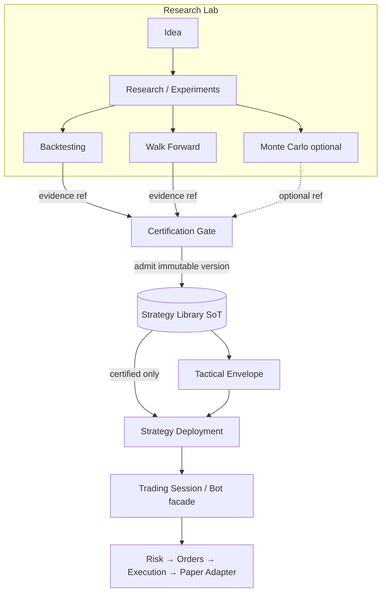

# RC-22 — Strategy Library Integration Diagram

**Document:** Strategy Library Integration (RC-22)  
**Status:** PLANNING — awaiting approval  
**Date:** 2026-08-10  
**Nature:** Architecture mapping only. No implementation.

**Parent:** [RC-22 Implementation Plan](./rc-22-implementation-plan.md)  
**Epics:** [RC-22 Epic Breakdown](./rc-22-epic-breakdown.md)  
**Constitution:** [Architecture Specification v2.0](./trp-architecture-specification-v2.md) §5, §6, §8  
**C4 context:** [V2 C4 Container Diagram](./v2-c4-container-diagram.md)

---

## 1. Task 2 — Integration mapping

Strategy Library integrates with **existing** Spec modules and current Lab/runtime surfaces. No future modules beyond approved architecture are introduced.

### 1.1 Research Lab

| Direction     | Interaction                                                                                                                            |
| ------------- | -------------------------------------------------------------------------------------------------------------------------------------- |
| Lab → Library | Produces validation **candidates** and **evidence artifacts** (experiments, campaigns, metrics). Does **not** mint Library membership. |
| Library → Lab | None required for RC-22 (Library does not drive research).                                                                             |

**Rule:** Research Lab never calls Execution Engine for capital (Spec §5.1). Certification is a separate admission step (Epic 3).

### 1.2 Backtesting

| Direction                   | Interaction                                                         |
| --------------------------- | ------------------------------------------------------------------- |
| Backtesting → certification | Supplies `backtestRef` (+ metrics inputs to certification summary). |
| Library → Backtesting       | None (Library does not re-run backtests).                           |

Backtesting remains a Lab capability. Results are referenced, not cloned into a second results warehouse (Knowledge Lake is out of scope).

### 1.3 Walk Forward

| Direction                    | Interaction                                              |
| ---------------------------- | -------------------------------------------------------- |
| Walk Forward → certification | Supplies `walkForwardRef` and robustness summary fields. |
| Library → Walk Forward       | None.                                                    |

Walk-forward evidence is a **required** validation input for certification when it is an active Lab gate (Implementation Plan).

### 1.4 Monte Carlo

| Direction                   | Interaction                                          |
| --------------------------- | ---------------------------------------------------- |
| Monte Carlo → certification | Optional `monteCarloRef` **when the engine exists**. |
| RC-22 build scope           | **Does not** implement Monte Carlo.                  |

Absence of Monte Carlo must not block Library foundation; ref is nullable until the method is available (Tactics Contract: “when available”).

### 1.5 Paper Trading

| Direction       | Interaction                                                                                      |
| --------------- | ------------------------------------------------------------------------------------------------ |
| Library → Paper | **Eligibility:** Paper Deployments/Sessions bind only `certificationStatus = certified` members. |
| Paper → Library | Operational outcomes may later feed research hypotheses; RC-22 does not build Lake projection.   |

Spec: Paper Trading must use only certified strategies. Pre-cert Lab simulation ≠ Paper Trading Session path.

### 1.6 Trading Session

| Direction         | Interaction                                                                           |
| ----------------- | ------------------------------------------------------------------------------------- |
| Library → Session | Via Strategy Deployment binding: Session carries certified version id / envelope ref. |
| Session → Library | Lifecycle commands do not mutate Library content.                                     |

Bot Facade (RC-19) remains a UI/application alias over Session — no Bot Library fork.

### 1.7 Tactical Envelope

| Direction                     | Interaction                                                                                             |
| ----------------------------- | ------------------------------------------------------------------------------------------------------- |
| Library → Envelope            | **SoT:** envelope body lives on certified version.                                                      |
| Envelope → Runtime/Deployment | Binding may snapshot/ref envelope; Runtime rejects out-of-envelope tactics (Epic 4–5).                  |
| RC-19 stub                    | Session-nullable stub becomes non-authoritative once Library binding exists; must not invent envelopes. |

Trading Orchestrator (future) may only select points inside Library envelopes — **not built in RC-22**.

### 1.8 Explicit non-integrations (this RC)

| Module                              | RC-22 stance                                                |
| ----------------------------------- | ----------------------------------------------------------- |
| Command Center                      | Deferred (RC-20; separate release)                          |
| Knowledge Lake                      | Deferred (RC-23 theme)                                      |
| Trading Orchestrator / Market State | Deferred (RC-26)                                            |
| Market Qualification / Profile      | Deferred (RC-25)                                            |
| Multi-exchange expansion            | Deferred (RC-27); Library only stores allowlisted scope ids |
| Risk / Orders / Execution / Ledger  | Consume eligibility indirectly; **no ownership change**     |

---

## 2. Integration diagram

### 2.1 Certification & eligibility (RC-22)

```text
                    ┌─────────────────────────────────────┐
                    │           RESEARCH LAB              │
                    │  Idea → experiments / campaigns     │
                    └──────────────┬──────────────────────┘
                                   │
           ┌───────────────────────┼───────────────────────┐
           ▼                       ▼                       ▼
    ┌─────────────┐        ┌──────────────┐        ┌──────────────┐
    │ Backtesting │        │ Walk Forward │        │ Monte Carlo  │
    │  (evidence) │        │  (evidence)  │        │ (optional)   │
    └──────┬──────┘        └──────┬───────┘        └──────┬───────┘
           │                      │                       │
           └──────────────────────┼───────────────────────┘
                                  │ evidence refs
                                  ▼
                    ┌─────────────────────────────────────┐
                    │         CERTIFICATION GATE          │
                    │  (human admit + required evidence)  │
                    └──────────────┬──────────────────────┘
                                   │ writes once
                                   ▼
                    ┌─────────────────────────────────────┐
                    │         STRATEGY LIBRARY            │
                    │  CertifiedStrategyVersion (SoT)     │
                    │  + Tactical Envelope                │
                    │  status: certified | deprecated     │
                    └──────────────┬──────────────────────┘
                                   │ eligibility query
                                   ▼
                    ┌─────────────────────────────────────┐
                    │       STRATEGY DEPLOYMENT           │
                    │  binds libraryEntryId + envelope    │
                    └──────────────┬──────────────────────┘
                                   │
                                   ▼
                    ┌─────────────────────────────────────┐
                    │         TRADING SESSION             │
                    │  (UI: Bot facade — same identity)   │
                    └──────────────┬──────────────────────┘
                                   │ Signal Intent path
                                   ▼
              Risk → Orders → Execution → Paper Adapter
                     (frozen path — unchanged ownership)
```

### 2.2 Mermaid (same topology)



### 2.3 Classification swimlane

```text
Research artifacts     →  Lab / Campaign / Experiment / Knowledge stores
Experimental strategy  →  Strategy registry (draft/active/archived)
Certified strategy     →  Strategy Library (immutable version)
Deprecated strategy    →  Strategy Library (status=deprecated; no new binds)
```

---

## 3. Authority summary

| Fact                         | SoT after RC-22                                           |
| ---------------------------- | --------------------------------------------------------- |
| Experimental strategy config | Strategy registry                                         |
| Certified version + envelope | **Strategy Library**                                      |
| Deployment binding           | Strategy Deployment                                       |
| Session lifecycle            | Trading Session                                           |
| Risk decision                | Risk Engine                                               |
| Orders / fills / ledger      | Unchanged Freeze owners                                   |
| Research evidence bodies     | Lab / campaign stores (Library holds refs + summary only) |

---

## 4. Dependency arrows (what RC-22 must not invert)

| Forbidden inversion                                    | Why                                       |
| ------------------------------------------------------ | ----------------------------------------- |
| Session writes Library certification                   | Ownership conflict; Runtime mutation risk |
| Deployment invents envelope points                     | Breaks Tactics Contract Option B          |
| Lab auto-inserts certified rows on profitable backtest | Skips certification gate                  |
| UI/Bot table stores parallel certified copy            | Duplicate strategy storage                |
| Risk Engine bypassed because “certified”               | Eligibility ≠ risk approval               |

---

## Approval

| Role               | Decision                    | Date |
| ------------------ | --------------------------- | ---- |
| Architecture owner | ☐ Approve ☐ Request changes |      |
| Tech lead          | ☐ Approve ☐ Request changes |      |
| Product owner      | ☐ Approve ☐ Request changes |      |
