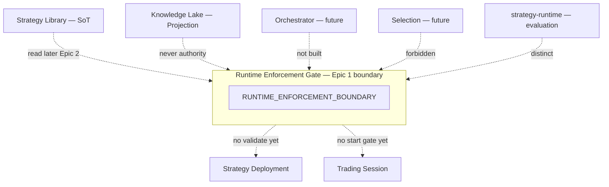

# RC-23 Epic 1 — Runtime Enforcement Boundary Diagram

**Document:** Runtime Enforcement Boundary Diagram  
**Status:** Epic 1 implemented — awaiting review  
**Date:** 2026-08-10  
**Parent:** [Epic 1 Report](./rc-23-epic1-runtime-enforcement-boundary.md) · [Integration Diagram](./rc-23-runtime-integration-diagram.md)

---

## 1. Bounded context

```text
┌──────────────────────────────────────────────────────────────────┐
│                   RUNTIME ENFORCEMENT (Gate)                     │
│                   moduleId: runtime-enforcement                  │
│                                                                  │
│  Owns (declared — not implemented in Epic 1):                    │
│    • deployment validation boundary                              │
│    • runtime verification contract                               │
│    • enforcement PASS / FAIL                                     │
│    • rejection reason catalog                                    │
│                                                                  │
│  Epic 1 activePorts: ALL false                                   │
│  Mantra: validates ≠ decides                                     │
└──────────────────────────────────────────────────────────────────┘
```

---

## 2. Ownership map

```text
┌─────────────────────┐
│  STRATEGY LIBRARY   │  SoT: Strategy / Version / Cert / Eligibility / Envelope
│  (RC-22 CLOSED)     │
└──────────┬──────────┘
           │ read-only (Epic 2+)
           ▼
┌─────────────────────┐
│ RUNTIME ENFORCEMENT │  Gate: PASS / FAIL only
│  (RC-23 Epic 1)     │
└──────────┬──────────┘
           │ PASS only (Epic 4–5)
     ┌─────┴─────┐
     ▼           ▼ FAIL → reject
┌──────────┐
│ Strategy │  SoT: binding (Mission ≡ Deployment)
│Deployment│
└────┬─────┘
     ▼
┌──────────┐
│ Trading  │  SoT: lifecycle (Bot ≡ Session)
│ Session  │
└────┬─────┘
     ▼
Risk → Orders → Execution → Paper Adapter
       (frozen path — unchanged)
```

---

## 3. What Enforcement must not absorb

```text
✗ Strategy certification (admit / deprecate / archive)
✗ StrategyEligibility SoT
✗ Library Tactical Envelope SoT
✗ Trading Session lifecycle
✗ Strategy Deployment binding SoT
✗ Knowledge Lake as gate authority
✗ Strategy Selection
✗ Trading Orchestrator product
✗ Market State Engine product
✗ Risk approval / Orders / Execution
✗ Soft-fail / warn-and-continue
✗ Bot aggregate as enforcement SoT
✗ Reverse write: Session → Library certification
```

---

## 4. Authority conflict rules (Epic 1)

| Dispute                              | Winner                                             |
| ------------------------------------ | -------------------------------------------------- |
| Certified membership / certification | **Strategy Library**                               |
| Eligibility status                   | **Strategy Library**                               |
| Tactical envelope                    | **Strategy Library**                               |
| Enforcement PASS / FAIL              | **Runtime Enforcement**                            |
| Session lifecycle                    | Trading Session                                    |
| Deployment binding                   | Strategy Deployment                                |
| Analytical Lake facts                | Knowledge Lake (Projection) — **never authorizes** |

---

## 5. Dependency direction

```text
Strategy Library ──read──▶ Runtime Enforcement     (Epic 2+)
Runtime Enforcement ──X──▶ Strategy Library writes (forbidden forever)
Trading Session ──X──▶ Strategy Library cert       (forbidden forever)
Knowledge Lake ──X──▶ Runtime Enforcement auth     (forbidden forever)
```

Epic 1: Enforcement module has **no** Library / Session / Deployment Nest imports yet.

---

## 6. Mermaid



---

## Approval

| Role               | Decision                    | Date |
| ------------------ | --------------------------- | ---- |
| Architecture owner | ☐ Approve ☐ Request changes |      |
| Tech lead          | ☐ Approve ☐ Request changes |      |
