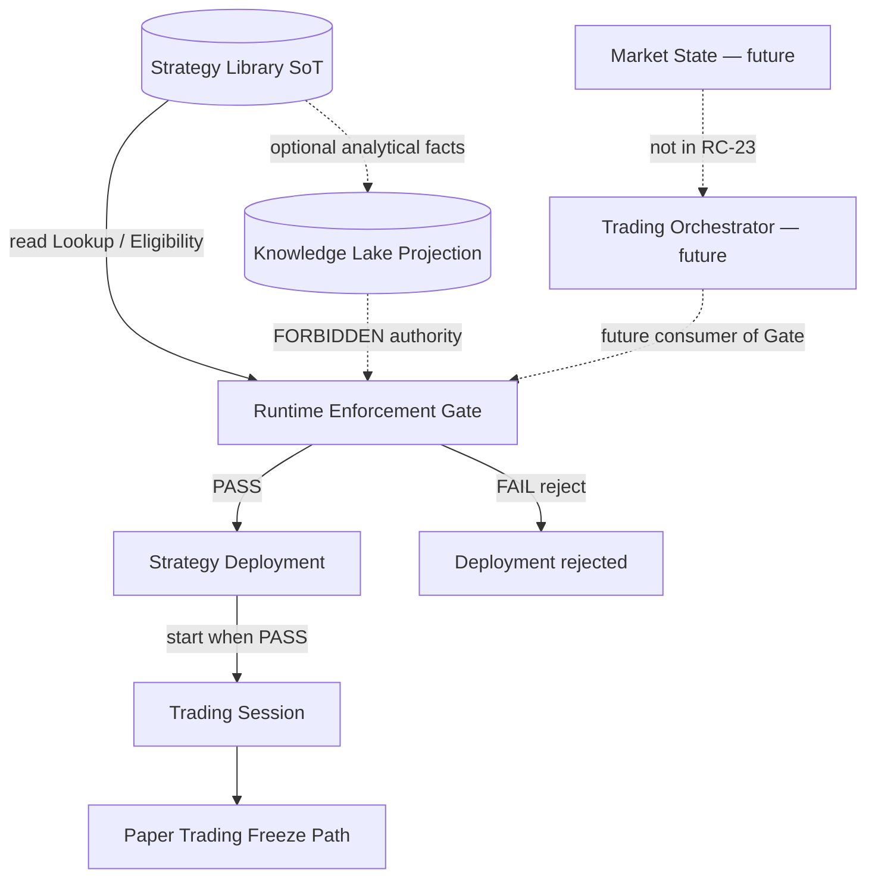

# RC-23 — Runtime Integration Diagram

**Document:** Runtime Enforcement Integration (RC-23)  
**Status:** APPROVED — Epic 1 boundary mapped (awaiting review)  
**Date:** 2026-08-10  
**Nature:** Architecture mapping only. No implementation.

**Parent:** [RC-23 Implementation Plan](./rc-23-implementation-plan.md)  
**API:** [API Contract](./rc-23-api-contract.md)  
**Enforcement:** [Runtime Enforcement Contract](./rc-23-runtime-enforcement-contract.md)  
**Epics:** [Epic Breakdown](./rc-23-epic-breakdown.md)  
**Library integration (predecessor):** [RC-22 Strategy Library Integration](./rc-22-strategy-library-integration.md)  
**Constitution:** [Architecture Specification v2.0](./trp-architecture-specification-v2.md) §5, §6, §8  
**C4 context:** [V2 C4 Container Diagram](./v2-c4-container-diagram.md)

---

## 1. Integration principle

Strategy Library is the **Source of Truth**. Runtime Enforcement is a **one-way Gate**. Trading Session consumes PASS only. Paper Trading remains the existing Freeze path.

```text
Strategy Library
        ↓  (read-only)
Runtime Enforcement
        ↓  (PASS only)
Trading Session
        ↓
Paper Trading
```

**There must be no reverse dependency.**

- Session / Runtime must not write Library certification.
- Paper Trading must not invent eligibility.
- Library must not depend on Session lifecycle to remain SoT.
- Knowledge Lake must not authorize enforcement.

**Library never executes. Enforcement never certifies. Session never selects. Paper never owns membership.**

---

## 2. Authority classes on this diagram

| Element                     | Class                 | Role in RC-23                                           |
| --------------------------- | --------------------- | ------------------------------------------------------- |
| Strategy Library            | **SoT**               | Strategy, Version, Certification, Eligibility, Envelope |
| Runtime Enforcement         | **Gate**              | PASS/FAIL over Library reads                            |
| Strategy Deployment         | **SoT** (binding)     | Binds only after PASS; does not certify                 |
| Trading Session             | **SoT** (lifecycle)   | Starts only after PASS; Bot = alias                     |
| Paper Trading path          | **Freeze path**       | Unchanged algorithms after Session start                |
| Knowledge Lake              | **Projection**        | Not an enforcement input                                |
| Trading Orchestrator        | **Future consumer**   | **Not built** — may later call same Gate                |
| Market State Engine         | **Future**            | **Not built** — no edge in RC-23                        |
| RC-19 Session envelope stub | **Non-authoritative** | Library envelope wins                                   |

---

## 3. Required topology (normative)

### 3.1 Primary chain

```text
┌──────────────────────────┐
│     STRATEGY LIBRARY     │  SoT
│  Strategy / Version      │
│  Certification (Active)  │
│  StrategyEligibility     │
│  Library Tactical Envelope│
└────────────┬─────────────┘
             │ read-only (Lookup / Eligibility)
             ▼
┌──────────────────────────┐
│  RUNTIME ENFORCEMENT     │  Gate
│  validate → PASS | FAIL  │
└────────────┬─────────────┘
             │
      ┌──────┴──────┐
      │ PASS        │ FAIL
      ▼             ▼
┌─────────────┐  Deployment rejected
│  TRADING    │  (deterministic reasons)
│  SESSION    │
└──────┬──────┘
       │ existing Signal Intent path
       ▼
┌──────────────────────────┐
│     PAPER TRADING        │
│  Risk → Orders → Exec    │
│  (paper adapter)         │
└──────────────────────────┘
```

### 3.2 Explicit non-edges (no reverse dependency)

```text
FORBIDDEN:
  Trading Session ──write──▶ Strategy Library certification
  Paper Trading ──authorize──▶ Eligibility
  Runtime Enforcement ──admit──▶ Certification
  Knowledge Lake ──authorize──▶ Runtime Enforcement
  Market State ──select──▶ Strategy (RC-23)
  Orchestrator product ──exists──▶ (RC-23)
```

---

## 4. Module interactions

### 4.1 Strategy Library → Runtime Enforcement

| Direction             | Interaction                                                  |
| --------------------- | ------------------------------------------------------------ |
| Library → Enforcement | Read: existence, Active certification, eligibility, envelope |
| Enforcement → Library | **None** for writes. No certify / deprecate / archive.       |

### 4.2 Runtime Enforcement → Trading Session

| Direction             | Interaction                                           |
| --------------------- | ----------------------------------------------------- |
| Enforcement → Session | PASS permits start; FAIL refuses deployment/start     |
| Session → Enforcement | May invoke validate at start; must not mutate Library |

### 4.3 Trading Session → Paper Trading

| Direction            | Interaction                                            |
| -------------------- | ------------------------------------------------------ |
| Session → Paper path | Existing Freeze path after start (unchanged ownership) |
| Paper → Enforcement  | **None** as authority                                  |

### 4.4 Strategy Deployment (bind surface)

| Direction                | Interaction                                          |
| ------------------------ | ---------------------------------------------------- |
| Deployment → Enforcement | Must validate before successful bind                 |
| Enforcement → Deployment | PASS/FAIL                                            |
| Deployment → Library     | May snapshot refs after PASS — never invent envelope |

### 4.5 Knowledge Lake

| Direction          | Interaction                                       |
| ------------------ | ------------------------------------------------- |
| Library → Lake     | Existing optional projections (RC-22) — unchanged |
| Lake → Enforcement | **Forbidden** as authority                        |

### 4.6 Future Orchestrator / Market State (not built)

Documented for boundary clarity only:

```text
Market State ──▶ Orchestrator ──Lookup/Eligibility/Enforcement──▶ Library / Gate
```

**RC-23 does not implement these modules.**

---

## 5. Mermaid — RC-23 topology



---

## 6. Behaviour swimlane

```text
Caller (existing deployment flow)
  → ValidateDeploymentRequest
Runtime Enforcement
  → read Library
  → PASS | FAIL + reasons[]
Strategy Deployment / Trading Session
  → PASS: bind / start
  → FAIL: reject
Paper Trading
  → runs only after Session start (unchanged path)
```

---

## 7. Forbidden dependencies (summary)

| Forbidden inversion                  | Why                                       |
| ------------------------------------ | ----------------------------------------- |
| Session writes Library certification | Ownership conflict; Runtime mutation risk |
| Enforcement invents eligibility      | Library owns eligibility SoT              |
| Lake authorizes PASS                 | Lake is Projection                        |
| Deployment invents envelope points   | Breaks Tactics Contract Option B          |
| Soft-fail into Paper Trading         | Spec requires certified-only production   |
| Orchestrator / Selection under RC-23 | Explicit non-goal                         |
| Risk bypassed because “certified”    | Eligibility ≠ risk approval               |
| Reverse SoT: Paper owns membership   | Duplicate strategy storage                |

---

## 8. Authority summary (after RC-23)

| Fact                         | SoT / class                     |
| ---------------------------- | ------------------------------- |
| Certified version + envelope | **Strategy Library**            |
| Eligibility records          | **Strategy Library**            |
| Enforcement PASS/FAIL        | **Runtime Enforcement** (Gate)  |
| Deployment binding           | Strategy Deployment             |
| Session lifecycle            | Trading Session                 |
| Paper path algorithms        | Unchanged Freeze owners         |
| Certification analytics copy | Knowledge Lake (Projection)     |
| Strategy selection           | Future Orchestrator (not RC-23) |
| Market State                 | Future (not RC-23)              |

---

## Approval

| Role               | Decision                    | Date |
| ------------------ | --------------------------- | ---- |
| Architecture owner | ☐ Approve ☐ Request changes |      |
| Tech lead          | ☐ Approve ☐ Request changes |      |
| Product owner      | ☐ Approve ☐ Request changes |      |
