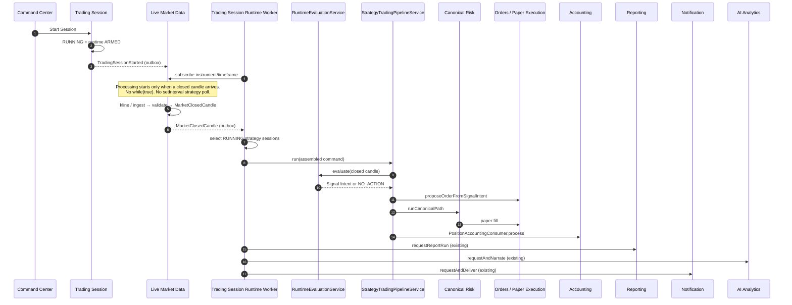

# Runtime Sequence Diagram

**Document:** Runtime Sequence Diagram  
**Status:** Canonical production Runtime document  
**Date:** 2026-08-16  
**Nature:** Implementation of the paper Runtime Engine as it runs. Not intended architecture. Not an RC.

One page. Architecture Specification v2.0, the Authority Matrix, and the Alias Dictionary are unchanged.

---

## Production runtime

```text
Closed Candle
    ↓
Market Feed
    ↓
Trading Session Runtime Worker
    ↓
RuntimeEvaluationService
    ↓
StrategyTradingPipelineService.run()
    ↓
Canonical Risk
    ↓
Paper Order
    ↓
Accounting
    ↓
Reporting
    ↓
Notification
    ↓
AI Narrative
```



---

## What each arrow is in code

| Stage                         | Production unit                                                                               | Owner (unchanged)                                     |
| ----------------------------- | --------------------------------------------------------------------------------------------- | ----------------------------------------------------- |
| Start Session                 | `TradingSessionService.start` → `runtime.arm`                                                 | Trading Session / Strategy Runtime lifecycle          |
| Subscribe                     | Outbox `TradingSessionStarted` → `MarketSubscriptionRegistry.subscribe`                       | Live Market Data (write triggered by session event)   |
| Closed Candle                 | `ClosedCandleIngestService` (connector kline or accepted event) → Outbox `MarketClosedCandle` | Live Market Data                                      |
| Runtime Worker                | `TradingSessionRuntimeWorker` durable outbox consumer                                         | Strategy Trading Pipeline (existing composition root) |
| Runtime evaluation            | `StrategyTradingPipelineService.run` → `RuntimeEvaluationService.evaluate`                    | Strategy Runtime                                      |
| Pipeline                      | same `run()` as US223                                                                         | Strategy Trading Pipeline                             |
| Canonical Risk                | `CanonicalOrderPathService.runCanonicalPath`                                                  | Risk / Execution                                      |
| Paper Order                   | `OrderService.proposeOrderFromSignalIntent`                                                   | Orders                                                |
| Accounting                    | `PositionAccountingConsumer.process` (already inside `run`)                                   | Positions / Ledger                                    |
| Reporting / Notification / AI | `ReportNarrativeConsumerService` + `ReportNotificationConsumerService` after `filled`         | product-flow consumers of existing owners             |

Start Session does not place an order by itself. After start, a closed candle is sufficient. No extra REST command. No test-only `pipeline.run` caller in production.
