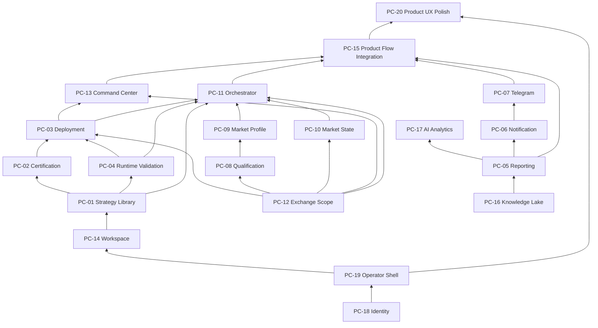

# Version 2 Product Completion Roadmap

**Document:** Version 2 Product Completion Roadmap  
**Nature:** Program Charter — governing document for completing Version 2 as a customer product  
**Status:** Approved — planning **CLOSED** — not an RC, not an ADR, not Version 3  
**Date:** 2026-08-15  
**Operational tracker:** [Version 2 Product Completion Backlog](./v2-product-completion-backlog.md)  
**Planning freeze:** [Product Completion Readiness Report](./product-completion-readiness-report.md) (**READY TO START PC-18**)

**Governance companions:**

| Document                                                         | Role                                    |
| ---------------------------------------------------------------- | --------------------------------------- |
| [Definition of Done](./product-completion-definition-of-done.md) | Mandatory package closure checklist     |
| [Product UI Policy](./product-ui-policy.md)                      | Forbids fake or misleading UI           |
| [Canonical Product Journey](./product-completion-journey.md)     | One Version 2 customer path (J-01…J-14) |

This is the **master product roadmap** for Version 2. Architecture delivery is finished. This document governs how certified capabilities become a complete paper-first customer product.

### Planning Status

| Track                 | Status             |
| --------------------- | ------------------ |
| Architecture Planning | **CLOSED**         |
| Product Planning      | **CLOSED**         |
| Governance            | **ACTIVE**         |
| Implementation        | **READY TO START** |

Do not add planning documents, governance documents, roadmap redesign, or package redesign. Future work is Implement → Review → Validate → Close, starting with **PC-18**.

---

## Part 0 — Program Governance

### Frozen — do not change

The following are **frozen** for the entire Product Completion Program:

| Artifact                                                                  | Status                                      | Product Completion may                          |
| ------------------------------------------------------------------------- | ------------------------------------------- | ----------------------------------------------- |
| [Architecture Specification v2.0](./trp-architecture-specification-v2.md) | Frozen constitution                         | Read. Never amend.                              |
| [Authority Matrix](./v2-authority-matrix.md)                              | Frozen SoT / projection / narrative classes | Read. Never amend.                              |
| [Alias Dictionary](./v2-alias-dictionary.md)                              | Frozen product language                     | Read. Never amend.                              |
| RC-19 … RC-28                                                             | **CLOSED**                                  | Cite. Never reopen. Never rewrite history.      |
| Architecture ownership                                                    | Frozen per Spec §5 and Authority Matrix     | Expose existing owners. Never move ownership.   |
| Business domains                                                          | Frozen (no new bounded contexts)            | Expose existing domains. Never invent new ones. |

### What this program is

**Product Completion is not an architecture program.**

**It is a product completion program.**

It exposes Version 2 capabilities that already exist — application ports, owners, and certified modules — through REST, UI, durable backing of existing aggregates, adapter completion on existing channel ports, and producer→consumer wiring.

### What this program is not

| Forbidden                      | Rule                           |
| ------------------------------ | ------------------------------ |
| Architecture evolution         | **Forbidden.**                 |
| New bounded contexts           | **Forbidden.**                 |
| New business domains           | **Forbidden.**                 |
| Ownership changes              | **Forbidden.**                 |
| New Source of Truth            | **Forbidden.**                 |
| Spec / Authority / Alias edits | **Forbidden.**                 |
| New ADR                        | **Forbidden.**                 |
| New RC                         | **Forbidden.**                 |
| Version 3                      | **Not started. Out of scope.** |

Architecture evolution is forbidden. If a proposal requires a Spec change, an ownership move, or a new domain, it is not Product Completion.

**Authority inputs (read-only):**

| Input                                            | Role                                                     |
| ------------------------------------------------ | -------------------------------------------------------- |
| Architecture Specification v2.0                  | Frozen constitution                                      |
| Authority Matrix                                 | Frozen SoT classes                                       |
| Alias Dictionary                                 | Frozen product language                                  |
| RC-19 … RC-28 closure and certification          | Closed architecture delivery                             |
| Version 2 Product Readiness Audit (2026-08-14)   | Product surface truth — **PRODUCT PARTIALLY READY, 55%** |
| Notification Delivery Product Audit (2026-08-14) | Delivery Layer vs operator product split                 |

---

## Part 1 — Executive Summary

### Why Version 2 architecture is complete

Version 2 (`v2.0.0`) is a certified paper-first platform. RC-28 closed Stabilization & Conformance. Architecture Specification v2.0 is the canonical constitution. The Authority Matrix and Alias Dictionary are unmodified. The twelve Version 2 surfaces exist as owned modules with application ports, in-process composition, and conformance tests:

Command Center, Knowledge Lake, Strategy Library, Runtime Enforcement, Reporting, AI Analytics, Notification Delivery, Market Qualification, Market Profile, Market State, Trading Orchestrator, Exchange Scope.

That certification answers: _does the system exist with correct ownership?_ It does. No new domain, Source of Truth, runtime, or ownership move is required to finish the customer product.

### Why Version 2 product is only partially ready

Architecture completeness is not product completeness.

If Version 2 shipped to a paying customer today they would receive a **research operating system plus a manual paper sandbox**. They would not receive the Version 2 product loop that certification describes:

```text
Create workspace → create strategy → certify → gate → deploy
  → orchestrate → paper session → report → notify (Telegram) → dashboard
```

The Product Readiness Audit scored **Overall Product Readiness 55%**. Dimension scores from that audit (baselines only — this program does not invent new percentages):

| Area                          | Audit baseline | Meaning                                                                                                              |
| ----------------------------- | -------------- | -------------------------------------------------------------------------------------------------------------------- |
| Architecture                  | 100%           | Closed. Out of scope for this program to change.                                                                     |
| Backend                       | 88%            | Application ports exist. Many stores are process-local.                                                              |
| Documentation                 | 100%           | Spec, contracts, closures exist.                                                                                     |
| Testing                       | 93%            | In-process and conformance tests. Not customer E2E.                                                                  |
| Paper trading                 | 76%            | Manual simulator works. Certified-strategy paper path does not.                                                      |
| Frontend                      | 48%            | Research + paper + partial Command Center. V2 modules mostly have no screens.                                        |
| Integration                   | 48%            | Ports compose in Vitest. Producers do not call each other in the running product.                                    |
| User experience               | 36%            | Canonical journey hard-stops at Certify.                                                                             |
| Production readiness          | 28%            | Live capital unauthorized. Live Bots nav is a false product.                                                         |
| **Overall product readiness** | **55%**        | Weighted mix in the audit. Follow-up identity and orchestrator-handoff facts lowered the first pass from 56% to 55%. |

Ten of twelve Version 2 modules set `rest: false`. Strategy Library lookup is not the Strategies page. Knowledge Lake is not `/knowledge`. RC-24 Reporting is not `/reports`. AI Analytics is not `/ai/execute`. There is no `/notifications` surface. Market Qualification, Market Profile, Market State, and Trading Orchestrator have no frontend files. Notification Delivery has **0 / 11** settings UI surfaces and **0 / 12** user actions. Reporting and AI never call `NotificationServicePort.deliver()` in application code. Orchestrator handoff is a coordination intent (`createsSession: false` by ownership — Orchestrator must never own Session). No existing Session/Deployment consumer starts a user paper session from that intent. Passwords live in an in-memory `Map`. Login does not survive process restart as a customer-account product.

**Architecture is closed. The customer-facing product is not.**

### Objective

Transform the certified Version 2 architecture into a complete **paper-first customer product** by exposing existing capabilities — without redesigning architecture, adding domains, moving ownership, or opening Version 3.

Success is a user who can complete:

```text
Sign in (durable account) → correct paper-first shell → workspace → research
  → certify into Strategy Library → Runtime Enforcement Gate → certified deploy
  → Trading Orchestrator selection → paper Trading Session (Bot) under Exchange Scope
  → RC-24 report → Telegram delivery → Command Center operations
```

using only ports and owners already certified in Version 2.

RCs built the platform. This roadmap ships the product. Execution is tracked in the [Backlog](./v2-product-completion-backlog.md).

---

## Part 2 — Program Principles

1. **No architecture changes.** Spec v2.0, Authority Matrix, and Alias Dictionary remain frozen. RC-19…RC-28 remain CLOSED.

2. **No new business domains.** Every work package maps to a Spec §5 surface or an already-shipped Freeze capability (Auth, Workspace, Paper Session, Strategy Deployment).

3. **No ownership changes.** Orchestrator does not create Sessions. Notification does not generate reports. Lake is never financial SoT. Command Center never owns lifecycle. UI never becomes SoT.

4. **UI may expose only existing backend capabilities.** If a port does not exist, the screen does not exist. No shadow APIs.

5. **REST may expose only existing application ports.** HTTP is transport for locked ports. REST is not a new bounded context.

6. **No business logic duplication.** Controllers and pages delegate. They do not re-implement certification, gating, routing, or risk.

7. **No bypasses.** Paper session start still passes Runtime Enforcement. Orchestrator still cannot submit orders. Telegram still cannot pause, resume, stop, or kill. Live capital remains unauthorized.

8. **Do not confuse legacy REST with Version 2 modules.** Completing the product means wiring V2 ports, not relabeling `/strategies`, `/knowledge`, `/reports`, or `/ai/execute`.

9. **Durable storage may back existing aggregates only.** Process-local stores may gain persistence of the same entities. That is not a new Source of Truth.

10. **Adapter completion is allowed; channel activation is not.** Telegram may gain a production adapter behind the existing Telegram channel port. Email, Slack, Discord, Teams, and Push stay reserved-inactive.

11. **Handoff stays an intent.** Product Flow Integration may add a **Session/Deployment consumer** of `SessionHandoffIntent`. It must not set Orchestrator `createsSession: true`. That flag is an ownership invariant, not a missing feature.

12. **Each package is independently deliverable.** No big-bang release. A package ships when its success slice is operable and its closure artifacts exist (Part 10).

13. **Paper-first product, not live product.** Completing Version 2 does not authorize live capital, real venue I/O, or new exchanges.

14. **Product language follows the Alias Dictionary.** UI may say Bot, Cluster, Wallet, Mission. Code and REST stay canonical.

15. **Operator Shell before more features.** After Identity, the operator must see the correct Version 2 product shell before additional functionality is added.

16. **Flow before polish.** PC-15 wires producers and consumers. PC-20 polishes UX. They are not the same package.

---

## Part 3 — Product Completion Rules

Explicitly forbidden for every package, every change, and every review:

| Forbidden                                      | Why                                                                                                 |
| ---------------------------------------------- | --------------------------------------------------------------------------------------------------- |
| Creating new bounded contexts                  | Architecture is frozen.                                                                             |
| Changing ownership                             | Authority Matrix is frozen.                                                                         |
| Changing Spec v2.0                             | Constitution is frozen.                                                                             |
| Changing Authority Matrix                      | SoT classes are frozen.                                                                             |
| Changing Alias Dictionary                      | Product language is frozen.                                                                         |
| Duplicating business logic                     | UI/REST delegate to existing ports.                                                                 |
| Creating alternative workflows                 | One canonical paper-first path.                                                                     |
| Renaming Version 2 architecture                | Canonical names stay canonical.                                                                     |
| Changing RC history                            | RC-19…RC-28 remain CLOSED as written.                                                               |
| Opening Version 3                              | This program finishes Version 2.                                                                    |
| Writing an ADR for Product Completion          | No ownership gap is being created.                                                                  |
| Opening a new RC                               | RCs are closed. Closure uses Part 10 artifacts.                                                     |
| Relabeling legacy REST as V2 modules           | `/strategies` ≠ Library, `/knowledge` ≠ Lake, `/reports` ≠ Reporting, `/ai/execute` ≠ AI Analytics. |
| Setting `createsSession: true` on Orchestrator | Ownership invariant. Session/Deployment consumes the intent.                                        |

A change that needs any row above is **out of this program**.

---

## Part 4 — Work Package Inventory

Inventory is taken from the Product Readiness Audit and the Notification Delivery Product Audit. Research Lab, manual paper sandbox, and legacy knowledge/strategy CRUD are **already customer-usable** and are not packages. Identifiers use **PC-** (Product Completion).

| ID        | Product Work Package         | Audit product signal             | Why it is missing as a product                                                                                           |
| --------- | ---------------------------- | -------------------------------- | ------------------------------------------------------------------------------------------------------------------------ |
| **PC-01** | Strategy Library Product     | 29%                              | Strategies page is US005 CRUD, not Library lookup / eligibility / lifecycle.                                             |
| **PC-02** | Certification Product        | Journey **No**                   | Domain and `StrategyLibraryCertificationPort` exist. No certify action, no REST, no screen. Canonical journey hard-stop. |
| **PC-03** | Deployment Product           | Production page retired (TD-034) | Certified Strategy Deployment is not operable. Paper create is name + balance only.                                      |
| **PC-04** | Runtime Validation Product   | 20%                              | `validateDeployment` is an invisible in-process gate. `rest: false`. Paper create does not call it.                      |
| **PC-05** | Reporting Product            | 36%                              | RC-24 ports have no REST/UI. Legacy `/reports` is a different slice.                                                     |
| **PC-06** | Notification Product         | 22%; 0/11 settings UI            | Preferences, routing, quiet hours exist on `NotificationServicePort` only.                                               |
| **PC-07** | Telegram Product             | 0/12 user actions                | Connect / bind / verify / test / disconnect are port-only. No production Bot network.                                    |
| **PC-08** | Qualification Product        | 12%                              | Qualification ports exist. No UI, REST false.                                                                            |
| **PC-09** | Market Profile Product       | 12%                              | Versioned profile ports exist. No UI. Orchestrator `profileConsumer` false.                                              |
| **PC-10** | Market State Product         | 10%                              | Classify / query ports exist. No UI.                                                                                     |
| **PC-11** | Trading Orchestrator Product | 12%                              | Service/Query ports exist. No UI. Handoff does not reach a user session.                                                 |
| **PC-12** | Exchange Scope Product       | 42%                              | Only `GET /exchange-scopes/default`. Exchanges page is adapter connect, not Cluster product.                             |
| **PC-13** | Command Center Product       | 68%                              | Fleet pause/resume/stop works. Cannot create a Bot. Emergency controls hardcoded unavailable.                            |
| **PC-14** | Workspace Management         | bootstrap-only                   | `POST /workspaces/bootstrap` only. No list / create / switch.                                                            |
| **PC-15** | Product Flow Integration     | Integration 48%                  | Producer→consumer wiring only. No UX. No polish.                                                                         |
| **PC-16** | Knowledge Lake Product       | 32%                              | Knowledge page searches `/knowledge`, not the Lake.                                                                      |
| **PC-17** | AI Analytics Product         | 39%                              | `/ai` uses OpenRouter `/ai/execute`, not `AIAnalyticsPort`.                                                              |
| **PC-18** | Identity Product             | Critical blocker                 | In-memory password map. Prefill `admin@trp.local`.                                                                       |
| **PC-19** | Operator Shell Product       | Frontend debt                    | Three nav bands. Live Bots beside Paper. Epic fixtures.                                                                  |
| **PC-20** | Product UX Polish            | UX 36%                           | Journey CTAs, dashboard polish, export, campaign history, onboarding, consistency.                                       |

**Not packages (already usable or out of scope):**

| Surface                                    | Disposition                                                         |
| ------------------------------------------ | ------------------------------------------------------------------- |
| Research Lab / RCC / campaigns / workflows | Implemented as product. Remaining usability sits in PC-20.          |
| Manual paper sandbox                       | Implemented. Certified paper path is PC-03 + PC-04 + PC-11 + PC-15. |
| Email / Slack / Discord / Teams / Push     | Reserved-inactive. Out of scope.                                    |
| Live capital / real BINANCE·BYBIT·OKX I/O  | Residual register. Out of scope.                                    |
| IDE shell                                  | Residual `ide-shell`. PC-19 is paper-first chrome, not an IDE.      |
| Multi-tenant SaaS / RBAC teams             | Product Vision non-goal. Out of scope.                              |

---

## Part 5 — Work Package Definition

Effort is product delivery time for a small team (UI + REST transport + wiring + tests), not architecture invention. **Business Impact** replaces estimated readiness-point gains. Tracking lives in the [Backlog](./v2-product-completion-backlog.md).

---

### PC-01 Strategy Library Product

| Field                   | Definition                                                                                                                                   |
| ----------------------- | -------------------------------------------------------------------------------------------------------------------------------------------- |
| **Purpose**             | Let a user browse, inspect, and manage certified library membership — the SoT for strategies that may enter the production path (Spec §5.2). |
| **Existing backend**    | Strategy Library module (RC-22). Immutable certified versions, tactical envelopes, eligibility, deprecate/archive.                           |
| **Existing ports**      | `StrategyLibraryRegistrationPort`, `StrategyLibraryLookupPort`, `StrategyLibraryEligibilityPort`, `StrategyLibraryLifecyclePort`.            |
| **Existing UI**         | `/strategies` — US005 record CRUD against `/v1/strategies`. **Not** this product.                                                            |
| **Missing UI**          | Library catalog, version detail, envelope view, eligibility status, deprecate/archive actions. Distinct from the research strategy editor.   |
| **Missing REST**        | Transport for Lookup / Eligibility / Lifecycle (and Registration as operator prep). Do not alias `/strategies`.                              |
| **Missing integration** | Eligibility visible to Deployment, Gate, and Orchestrator UIs as read-only facts.                                                            |
| **Missing UX**          | Empty library, not-certified vs certified, envelope empty vs present, forbidden “edit certified algorithm” states.                           |
| **Dependencies**        | PC-18 (durable login). PC-14 (workspace context). PC-19 (correct shell).                                                                     |
| **Priority**            | Critical                                                                                                                                     |
| **Estimated effort**    | M (2–3 weeks)                                                                                                                                |
| **Business Impact**     | **Critical** — without a Library product, certification has nowhere to land.                                                                 |

---

### PC-02 Certification Product

| Field                   | Definition                                                                                                                                                       |
| ----------------------- | ---------------------------------------------------------------------------------------------------------------------------------------------------------------- |
| **Purpose**             | Let a user admit a research candidate into the Strategy Library as an immutable certified version. This is the first hard stop of the canonical journey.         |
| **Existing backend**    | Certification domain + `StrategyLibraryCertificationPort`. Research Lab already produces evidence.                                                               |
| **Existing ports**      | `StrategyLibraryCertificationPort` (write). Consumes research evidence; does not rewrite experiments.                                                            |
| **Existing UI**         | None. Strategies page cannot certify.                                                                                                                            |
| **Missing UI**          | Certify flow: select candidate / evidence → confirm → certified version in Library. Failure reasons.                                                             |
| **Missing REST**        | Transport for certification commands and certification status reads.                                                                                             |
| **Missing integration** | Research result → certification candidate. After success, PC-01 catalog refreshes. Lake may receive an analytical copy via existing ingestion (projection only). |
| **Missing UX**          | Evidence checklist, irreversible-admit copy, reject reasons, no silent recertify/hot-edit.                                                                       |
| **Dependencies**        | PC-01. Research Lab (already shipped).                                                                                                                           |
| **Priority**            | Critical                                                                                                                                                         |
| **Estimated effort**    | M (2–3 weeks)                                                                                                                                                    |
| **Business Impact**     | **Critical** — audit journey hard-stop.                                                                                                                          |

---

### PC-03 Deployment Product

| Field                   | Definition                                                                                                                                                                                                           |
| ----------------------- | -------------------------------------------------------------------------------------------------------------------------------------------------------------------------------------------------------------------- |
| **Purpose**             | Let a user bind a **certified** library version (Mission ≡ Strategy Deployment) to a paper Trading Session. Restore an operable deploy path without reviving retired Stage-1 production controls as a second engine. |
| **Existing backend**    | Strategy Deployment / Session binding (Spec §5.6, Alias: Mission). Runtime Enforcement consumer. Paper session Prisma lifecycle.                                                                                     |
| **Existing ports**      | Existing Deployment / Trading Session start ports; must **consume** `RuntimeEnforcementPort.validateDeployment` and Library Lookup/Eligibility.                                                                      |
| **Existing UI**         | `/production` states deployment controls were retired (TD-034). `/trading/paper` creates name + `initialBalance` only.                                                                                               |
| **Missing UI**          | Deploy / assign-mission: pick certified version, envelope point, Exchange Scope, paper account; confirm Gate PASS; start session.                                                                                    |
| **Missing REST**        | Session/deploy transport that carries library identity + envelope + scope — not a new deploy engine.                                                                                                                 |
| **Missing integration** | Paper create must stop presenting uncertified blank bots as the V2 path (sandbox create may remain labeled sandbox).                                                                                                 |
| **Missing UX**          | Retired-page replacement or redirect. Clear paper-vs-live labeling. Block live-capital copy.                                                                                                                         |
| **Dependencies**        | PC-01, PC-02, PC-04, PC-12.                                                                                                                                                                                          |
| **Priority**            | Critical                                                                                                                                                                                                             |
| **Estimated effort**    | M (2–3 weeks)                                                                                                                                                                                                        |
| **Business Impact**     | **Critical** — certified paper cannot start without deploy.                                                                                                                                                          |

---

### PC-04 Runtime Validation Product

| Field                   | Definition                                                                                                                       |
| ----------------------- | -------------------------------------------------------------------------------------------------------------------------------- |
| **Purpose**             | Make the fail-closed Gate a user-visible product: a deployment is validated before a session starts.                             |
| **Existing backend**    | Runtime Enforcement (RC-23). `validateDeployment` active in-process.                                                             |
| **Existing ports**      | `RuntimeEnforcementPort`. Consumes `StrategyLibraryLookupPort`, `StrategyLibraryEligibilityPort`.                                |
| **Existing UI**         | None.                                                                                                                            |
| **Missing UI**          | Gate result: PASS / FAIL + reasons. Invoked from Deploy and Orchestrator confirmation. Optional standalone “validate” inspector. |
| **Missing REST**        | Transport for `validateDeployment` (pre-check and as part of start).                                                             |
| **Missing integration** | Paper/session start and Orchestrator handoff **must** call the Gate. Soft-pass forbidden.                                        |
| **Missing UX**          | Fail-closed copy, reason list, no “force deploy” control.                                                                        |
| **Dependencies**        | PC-01.                                                                                                                           |
| **Priority**            | Critical                                                                                                                         |
| **Estimated effort**    | S (1–2 weeks)                                                                                                                    |
| **Business Impact**     | **Critical** — Gate is the production-path integrity product.                                                                    |

---

### PC-05 Reporting Product

| Field                   | Definition                                                                                                                        |
| ----------------------- | --------------------------------------------------------------------------------------------------------------------------------- |
| **Purpose**             | Let a user request and read RC-24 report projections (session / period aggregations), labeled paper vs live, never as ledger SoT. |
| **Existing backend**    | Reporting module. `ReportDefinition`, `ReportRun`, `AggregationSlice`. Process-local store.                                       |
| **Existing ports**      | `ReportingServicePort` (`requestReportRun`, compare helper), `ReportingQueryPort`. Consumes Lake and history read ports.          |
| **Existing UI**         | Research/campaign/RCC analytics. **Not** RC-24.                                                                                   |
| **Missing UI**          | Report catalog, run request, run detail, paper/live badge, dashboard cards fed by `ReportRun` projections.                        |
| **Missing REST**        | Transport for Reporting Service/Query. Do not extend legacy `/v1/reports` as if it were this module.                              |
| **Missing integration** | Durable store for existing report entities. Session → report run and report → `deliver()` belong to **PC-15**, not this package.  |
| **Missing UX**          | Empty runs, in-progress, failed run, “projection not SoT” disclosure.                                                             |
| **Dependencies**        | PC-16 recommended (Lake feed). PC-03 for session-backed reports.                                                                  |
| **Priority**            | Critical                                                                                                                          |
| **Estimated effort**    | M (2–3 weeks)                                                                                                                     |
| **Business Impact**     | **Critical** — evidence product of the V2 loop.                                                                                   |

---

### PC-06 Notification Product

| Field                   | Definition                                                                                                                                                                                                                                     |
| ----------------------- | ---------------------------------------------------------------------------------------------------------------------------------------------------------------------------------------------------------------------------------------------- |
| **Purpose**             | Let a user enable notifications, choose Telegram routing, set quiet hours / daily time, and inspect delivery outcome — Delivery Layer only, authority none.                                                                                    |
| **Existing backend**    | Notification Delivery (RC-24). Master enable, per-channel enable, `typeRouting`, schedule, skip reasons. Certified types only.                                                                                                                 |
| **Existing ports**      | `NotificationServicePort`: listChannels, get/upsert preferences, deliver, sendTest.                                                                                                                                                            |
| **Existing UI**         | `/settings` is RCC preferences. Command Center `NotificationCenter` is RC-20 in-app operator toasts — a different product.                                                                                                                     |
| **Missing UI**          | Notification Settings page: master switch, per-type routing, quiet hours, daily delivery time, delivery status. Telegram test lives in PC-07.                                                                                                  |
| **Missing REST**        | Transport for preferences, channel catalog, delivery status.                                                                                                                                                                                   |
| **Missing integration** | Honor stored `dailyDeliveryTime` with a thin clock over existing preferences — not a new scheduler domain. Apply stored timezone. Durable store for existing preference/connection records. Producer calls to `deliver()` belong to **PC-15**. |
| **Missing UX**          | Empty/not-connected, quiet-hours skip, reserved-channel disabled (not offered). Mute/pause/resume stay out of scope (not on the port).                                                                                                         |
| **Dependencies**        | PC-18. Value realized after PC-05 and PC-07.                                                                                                                                                                                                   |
| **Priority**            | Critical                                                                                                                                                                                                                                       |
| **Estimated effort**    | M (2–3 weeks)                                                                                                                                                                                                                                  |
| **Business Impact**     | **Critical** — Delivery Layer is not a product until the user can configure it.                                                                                                                                                                |

---

### PC-07 Telegram Product

| Field                   | Definition                                                                                                                                                                           |
| ----------------------- | ------------------------------------------------------------------------------------------------------------------------------------------------------------------------------------ |
| **Purpose**             | Let a user connect Telegram, bind chat, verify, send a test, disconnect, and receive routed deliveries. Telegram remains a notification channel, never a control plane.              |
| **Existing backend**    | Telegram catalog status **active**. Connect / complete / verify / disconnect / test on the port. `InMemoryTelegramAdapter`.                                                          |
| **Existing ports**      | `NotificationServicePort` Telegram methods + Telegram channel adapter port.                                                                                                          |
| **Existing UI**         | None.                                                                                                                                                                                |
| **Missing UI**          | Connection wizard: Connect → deep link / token → Connected / error → Test → Disconnect. Status indicator.                                                                            |
| **Missing REST**        | Transport for connect, complete, verify, disconnect, test, status.                                                                                                                   |
| **Missing integration** | Production Telegram adapter **behind the existing channel port**. Completing verify is adapter + existing method, not a new domain. Chat id remains never typed as a user invariant. |
| **Missing UX**          | Pending, connected, failed, not-connected. Explicit copy: Telegram cannot trade, pause, or kill.                                                                                     |
| **Dependencies**        | PC-06.                                                                                                                                                                               |
| **Priority**            | Critical                                                                                                                                                                             |
| **Estimated effort**    | M (2–3 weeks)                                                                                                                                                                        |
| **Business Impact**     | **Critical** — the only active external channel in V2.                                                                                                                               |

---

### PC-08 Qualification Product

| Field                   | Definition                                                                                                                                          |
| ----------------------- | --------------------------------------------------------------------------------------------------------------------------------------------------- |
| **Purpose**             | Let a user trigger venue/market qualification and read run state, confidence, and health. Research artifact only — never forces trades (Spec §5.3). |
| **Existing backend**    | Market Qualification (RC-25). Live Market Data + Research read consumers.                                                                           |
| **Existing ports**      | `MarketQualificationServicePort`, `MarketQualificationQueryPort`.                                                                                   |
| **Existing UI**         | None.                                                                                                                                               |
| **Missing UI**          | Request/confirm qualification, run list, state/confidence/health. Confirm before heavy jobs (Spec).                                                 |
| **Missing REST**        | Transport for service + query ports.                                                                                                                |
| **Missing integration** | Publish-to-profile wiring belongs to **PC-15**. Orchestrator consumer reads belong to **PC-15**.                                                    |
| **Missing UX**          | Confirm-to-run, in-progress, failed, stale confidence. Never a “trade now” button.                                                                  |
| **Dependencies**        | PC-12. PC-18.                                                                                                                                       |
| **Priority**            | High                                                                                                                                                |
| **Estimated effort**    | M (2–3 weeks)                                                                                                                                       |
| **Business Impact**     | **High** — market research product; does not by itself complete the trading loop.                                                                   |

---

### PC-09 Market Profile Product

| Field                   | Definition                                                                                                      |
| ----------------------- | --------------------------------------------------------------------------------------------------------------- |
| **Purpose**             | Let a user inspect versioned Market Profiles as Orchestrator confidence inputs, not Risk and not execution SoT. |
| **Existing backend**    | Market Profile (RC-25). Versioned profile store.                                                                |
| **Existing ports**      | `MarketProfileServicePort`, `MarketProfileQueryPort`.                                                           |
| **Existing UI**         | None.                                                                                                           |
| **Missing UI**          | Latest / by-version profile viewer, confidence summary, version history.                                        |
| **Missing REST**        | Transport for query (publish remains the qualification pipeline’s existing call).                               |
| **Missing integration** | Qualification → publish and Orchestrator `profileConsumer` reads belong to **PC-15**.                           |
| **Missing UX**          | Version picker, “does not force trades” disclosure.                                                             |
| **Dependencies**        | PC-08.                                                                                                          |
| **Priority**            | High                                                                                                            |
| **Estimated effort**    | S (1–2 weeks)                                                                                                   |
| **Business Impact**     | **High**.                                                                                                       |

---

### PC-10 Market State Product

| Field                   | Definition                                                                                                                                   |
| ----------------------- | -------------------------------------------------------------------------------------------------------------------------------------------- |
| **Purpose**             | Let a user see current market-condition classification and transitions used as Orchestrator selection context (Spec §5.4). Does not execute. |
| **Existing backend**    | Market State (RC-26). Classify / refresh / expire; query current + transitions.                                                              |
| **Existing ports**      | `MarketStateServicePort`, `MarketStateQueryPort`, `MarketStateConsumerReadPort`.                                                             |
| **Existing UI**         | None.                                                                                                                                        |
| **Missing UI**          | Current state, transition history, refresh (user-triggered).                                                                                 |
| **Missing REST**        | Transport for query; optional refresh command.                                                                                               |
| **Missing integration** | Pointing Orchestrator at the real query port belongs to **PC-15**.                                                                           |
| **Missing UX**          | Stale/expired state, no “override risk” control.                                                                                             |
| **Dependencies**        | PC-12.                                                                                                                                       |
| **Priority**            | High                                                                                                                                         |
| **Estimated effort**    | S (1–2 weeks)                                                                                                                                |
| **Business Impact**     | **High**.                                                                                                                                    |

---

### PC-11 Trading Orchestrator Product

| Field                   | Definition                                                                                                                                                                                                                                                                  |
| ----------------------- | --------------------------------------------------------------------------------------------------------------------------------------------------------------------------------------------------------------------------------------------------------------------------- |
| **Purpose**             | Let a user request coordination: select among certified strategies/tactics inside the envelope, using Market State, Profile confidence, and Exchange Scope policy, and emit a `SessionHandoffIntent`. Orchestrator is not Execution, not AI, not Session owner (Spec §5.5). |
| **Existing backend**    | Trading Orchestrator (RC-26). Workflow: Market State → Library → Gate → handoff intent. In-memory coordination store.                                                                                                                                                       |
| **Existing ports**      | `TradingOrchestratorServicePort`, `TradingOrchestratorQueryPort`.                                                                                                                                                                                                           |
| **Existing UI**         | None.                                                                                                                                                                                                                                                                       |
| **Missing UI**          | Run orchestration, show selection decision, show Gate outcome, show handoff intent. Confirm start is a **Session/Deployment** action (PC-03 / PC-15), not an Orchestrator “create bot” command.                                                                             |
| **Missing REST**        | Transport for service + query.                                                                                                                                                                                                                                              |
| **Missing integration** | Do **not** set `createsSession: true`. Session consumption of the intent is **PC-15**. Durable store for existing run/decision/intent records is in this package.                                                                                                           |
| **Missing UX**          | Never imply AI trades. Show rejected Gate. No order ticket on this screen.                                                                                                                                                                                                  |
| **Dependencies**        | PC-01, PC-04, PC-09, PC-10, PC-12. PC-03 to make handoff useful.                                                                                                                                                                                                            |
| **Priority**            | Critical                                                                                                                                                                                                                                                                    |
| **Estimated effort**    | M (3–4 weeks)                                                                                                                                                                                                                                                               |
| **Business Impact**     | **Critical** — selection product of the V2 loop.                                                                                                                                                                                                                            |

---

### PC-12 Exchange Scope Product

| Field                   | Definition                                                                                                                                                                                          |
| ----------------------- | --------------------------------------------------------------------------------------------------------------------------------------------------------------------------------------------------- |
| **Purpose**             | Let a user view and configure the isolation boundary (UI: Cluster): identity, capacity, allowlists, Exchange Risk Policy **inputs**, account binding. Not a microservice. Not a second Risk engine. |
| **Existing backend**    | Exchange Scope (RC-19 identity, RC-27 façades). Default Binance scope. `GET /v1/exchange-scopes/default`.                                                                                           |
| **Existing ports**      | `ExchangeScopeServicePort`, `ExchangeScopeQueryPort`, `ExchangeScopeConsumerReadPort`.                                                                                                              |
| **Existing UI**         | Command Center default-scope panel. `/trading/exchanges` adapter connect (MOCK usable; venue I/O stubbed).                                                                                          |
| **Missing UI**          | Cluster page: list/get scopes, capacity, policy inputs, account bindings, activate/suspend (existing commands).                                                                                     |
| **Missing REST**        | Beyond GET default: list/get/config/policy/bindings and service commands already on the port.                                                                                                       |
| **Missing integration** | Command Center and Orchestrator read scope projections. Do not add real venue adapters.                                                                                                             |
| **Missing UX**          | Cluster ≠ engine. Stub venues must not look live (PC-19 also enforces this in chrome).                                                                                                              |
| **Dependencies**        | PC-18. PC-13 consumes it.                                                                                                                                                                           |
| **Priority**            | High                                                                                                                                                                                                |
| **Estimated effort**    | M (2–3 weeks)                                                                                                                                                                                       |
| **Business Impact**     | **High**.                                                                                                                                                                                           |

---

### PC-13 Command Center Product

| Field                   | Definition                                                                                                                                                                                                                       |
| ----------------------- | -------------------------------------------------------------------------------------------------------------------------------------------------------------------------------------------------------------------------------- |
| **Purpose**             | Complete the operations workspace: “what is happening now?” and “can I stop it safely?” via Session command ports only.                                                                                                          |
| **Existing backend**    | Command Center projections. Pause / resume / stop via `/v1/trading-sessions`. Bot Facade delegates to Trading Session.                                                                                                           |
| **Existing ports**      | Session lifecycle commands; Exchange Scope consumer reads; RC-20 emergency contract against durable Kill Switch / Session safety.                                                                                                |
| **Existing UI**         | `/command-center`: fleet view, filter, pause/resume/stop. Emergency region visible, all actions `unavailable`. Cannot create a Bot.                                                                                              |
| **Missing UI**          | Create Bot = start/bind session through **existing Session/Deploy ports** (after PC-03). Emergency Stop / Clear Kill Switch **only if** durable Risk/Session safety ports already exist — wire them; do not invent UI-only kill. |
| **Missing REST**        | Create/bind may reuse paper/session/deploy transport from PC-03. Emergency uses existing safety ports.                                                                                                                           |
| **Missing integration** | Report tiles and delivery status as projections are **PC-15** dashboard data flow.                                                                                                                                               |
| **Missing UX**          | Remove “danger zone that does nothing” or enable it for real. Projection disclaimer.                                                                                                                                             |
| **Dependencies**        | PC-03 for create. PC-12. Safety ports for emergency (Freeze owners).                                                                                                                                                             |
| **Priority**            | Critical                                                                                                                                                                                                                         |
| **Estimated effort**    | M (2–3 weeks)                                                                                                                                                                                                                    |
| **Business Impact**     | **Critical** — operator home of the paper journey.                                                                                                                                                                               |

---

### PC-14 Workspace Management

| Field                     | Definition                                                                                                                           |
| ------------------------- | ------------------------------------------------------------------------------------------------------------------------------------ |
| **Purpose**               | Let a user list, create, switch, and understand workspace context. Workspace is already a Freeze concept; only bootstrap is exposed. |
| **Existing backend**      | Workspace bootstrap. `WorkspaceProvider` already models an active workspace and a select operation.                                  |
| **Existing ports / REST** | `POST /v1/workspaces/bootstrap` only.                                                                                                |
| **Existing UI**           | Header shows workspace name. No admin screen.                                                                                        |
| **Missing UI**            | List, named create, switch. Delete only if an existing workspace command already allows it.                                          |
| **Missing REST**          | List / create / switch transports over the existing workspace owner.                                                                 |
| **Missing integration**   | All V2 queries already keyed by workspace where ports require it.                                                                    |
| **Missing UX**            | Switcher lives in the PC-19 shell. No tenant/RBAC expansion.                                                                         |
| **Dependencies**          | PC-18. PC-19 (shell exists before workspace chrome is added).                                                                        |
| **Priority**              | High                                                                                                                                 |
| **Estimated effort**      | S (1–2 weeks)                                                                                                                        |
| **Business Impact**       | **High**.                                                                                                                            |

---

### PC-15 Product Flow Integration

| Field                   | Definition                                                                                                                                                                                                                                                                                                                                                                                                                                                                                                                                                                                         |
| ----------------------- | -------------------------------------------------------------------------------------------------------------------------------------------------------------------------------------------------------------------------------------------------------------------------------------------------------------------------------------------------------------------------------------------------------------------------------------------------------------------------------------------------------------------------------------------------------------------------------------------------- |
| **Purpose**             | Make certified data flows run for a user, not only inside `v2-e2e-success-path.spec.ts`. **Wiring only.** No UX. No polish.                                                                                                                                                                                                                                                                                                                                                                                                                                                                        |
| **Existing backend**    | Every producer and consumer port already exists. RC-28 proved in-process composition.                                                                                                                                                                                                                                                                                                                                                                                                                                                                                                              |
| **Existing ports**      | Gate, Orchestrator, Session, Lake, Reporting, `AIAnalyticsPort`, `NotificationServicePort.deliver`, Command Center projections.                                                                                                                                                                                                                                                                                                                                                                                                                                                                    |
| **Existing UI**         | None in this package. Screens belong to other PC packages. Polish belongs to PC-20.                                                                                                                                                                                                                                                                                                                                                                                                                                                                                                                |
| **Missing UI**          | **None.** This package does not add screens, CTAs, export buttons, or onboarding.                                                                                                                                                                                                                                                                                                                                                                                                                                                                                                                  |
| **Missing REST**        | None new. Uses transports from other PC packages.                                                                                                                                                                                                                                                                                                                                                                                                                                                                                                                                                  |
| **Missing integration** | **Must wire, using existing owners:** Reporting → AI; Reporting → Notification (`deliver()`); Notification → Channels (Telegram adapter path); Qualification → Profile; Orchestrator → Session (**Session/Deployment consumes `SessionHandoffIntent`**; Orchestrator still `createsSession: false`); Dashboard data flow (ReportRun / delivery status projections into Home and Command Center — data only). Profile/State/Library → Orchestrator **reads**. Gate on every deploy. Running paper session → RC-24 `requestReportRun`. Do not invent notification types that are not in the catalog. |
| **Missing UX**          | **None.** Journey consistency, CTAs, labels, export, campaign history, progress, onboarding are **PC-20**.                                                                                                                                                                                                                                                                                                                                                                                                                                                                                         |
| **Dependencies**        | Incremental after each producer: PC-03, PC-05, PC-06, PC-07, PC-08, PC-09, PC-10, PC-11, PC-13, PC-16, PC-17. Final close when those producers are present.                                                                                                                                                                                                                                                                                                                                                                                                                                        |
| **Priority**            | Critical                                                                                                                                                                                                                                                                                                                                                                                                                                                                                                                                                                                           |
| **Estimated effort**    | L (3–5 weeks, interleaved)                                                                                                                                                                                                                                                                                                                                                                                                                                                                                                                                                                         |
| **Business Impact**     | **Critical** — without wiring, surfaces stay disconnected.                                                                                                                                                                                                                                                                                                                                                                                                                                                                                                                                         |

---

### PC-16 Knowledge Lake Product

| Field                   | Definition                                                                                                                       |
| ----------------------- | -------------------------------------------------------------------------------------------------------------------------------- |
| **Purpose**             | Let a user query the analytical warehouse (append-only projection). Never balances, never Orders rewrite (Spec §5.13).           |
| **Existing backend**    | Knowledge Lake (RC-21). Ingestion + query certified.                                                                             |
| **Existing ports**      | `KnowledgeLakeIngestionPort` (producers only), `KnowledgeLakeQueryPort`.                                                         |
| **Existing UI**         | `/knowledge` searches `/v1/knowledge` (US079). **Not** the Lake.                                                                 |
| **Missing UI**          | Lake explorer: filter by category, time, producer, session, exchange scope, workspace. Distinct route or clearly separated mode. |
| **Missing REST**        | Transport for `KnowledgeLakeQueryPort`. Do not morph `/knowledge`.                                                               |
| **Missing integration** | Keep producer ingestion internal. Reporting/AI already consume query in-process; UI should not write the Lake.                   |
| **Missing UX**          | “Analytical copy / not SoT” disclosure.                                                                                          |
| **Dependencies**        | PC-18. Feeds PC-05 / PC-17.                                                                                                      |
| **Priority**            | High                                                                                                                             |
| **Estimated effort**    | M (2–3 weeks)                                                                                                                    |
| **Business Impact**     | **High**.                                                                                                                        |

---

### PC-17 AI Analytics Product

| Field                   | Definition                                                                                                                                             |
| ----------------------- | ------------------------------------------------------------------------------------------------------------------------------------------------------ |
| **Purpose**             | Let a user request an `AnalyticalNarrative` that cites RC-24 reports and Lake refs. Narrative only. Never capital, never Gate, never tactic invention. |
| **Existing backend**    | AI Analytics (RC-24). Reads Reporting query ports in-process.                                                                                          |
| **Existing ports**      | `AIAnalyticsPort`.                                                                                                                                     |
| **Existing UI**         | `/ai` → `POST /v1/ai/execute` (OpenRouter gateway).                                                                                                    |
| **Missing UI**          | Generate/view narratives from a ReportRun / Lake context. Cite links.                                                                                  |
| **Missing REST**        | Transport for `AIAnalyticsPort`. Keep `/ai/execute` as the gateway, not this product.                                                                  |
| **Missing integration** | Expose in-process Reporting→AI. Optional `deliver()` of an **existing** type is **PC-15**. Do not add catalog types.                                   |
| **Missing UX**          | “Explanation, not an order.” No one-click trade.                                                                                                       |
| **Dependencies**        | PC-05, PC-16.                                                                                                                                          |
| **Priority**            | Medium                                                                                                                                                 |
| **Estimated effort**    | S–M (2 weeks)                                                                                                                                          |
| **Business Impact**     | **Medium** — narrative on an already-working report; not a journey blocker.                                                                            |

---

### PC-18 Identity Product

| Field                     | Definition                                                                                                                     |
| ------------------------- | ------------------------------------------------------------------------------------------------------------------------------ |
| **Purpose**               | Make login a customer-account product: credentials survive restart; no prefilled shared admin password as the product path.    |
| **Existing backend**      | JWT guard. Login / register / health public. `PasswordCredentialStore` in-memory Map. Dev bootstrap reseeds `admin@trp.local`. |
| **Existing ports / REST** | `/auth` login/register.                                                                                                        |
| **Existing UI**           | `/login` Connect. Default credentials prefilled.                                                                               |
| **Missing UI**            | Register/sign-in without shipping default password in the form.                                                                |
| **Missing REST**          | None new. Persist the **existing** credential records.                                                                         |
| **Missing integration**   | Development seed may remain for engineers; it is not the customer product.                                                     |
| **Missing UX**            | Restart-safe session. No `trp-admin-change-me` in the paying-user path.                                                        |
| **Dependencies**          | None. First package.                                                                                                           |
| **Priority**              | Critical                                                                                                                       |
| **Estimated effort**      | S (1 week)                                                                                                                     |
| **Business Impact**       | **Critical** — there is no customer product without a durable account.                                                         |

---

### PC-19 Operator Shell Product

| Field                   | Definition                                                                                                                                                                                                  |
| ----------------------- | ----------------------------------------------------------------------------------------------------------------------------------------------------------------------------------------------------------- |
| **Purpose**             | Present one paper-first product shell **before** additional Version 2 surfaces are added, so the operator immediately experiences the correct product.                                                      |
| **Existing backend**    | None required. Nav is `AppLayout` over existing routes.                                                                                                                                                     |
| **Existing ports**      | N/A.                                                                                                                                                                                                        |
| **Existing UI**         | Three bands: RCC, Trading, Legacy laboratory. Live Bots in primary trading nav. Epic 3–6 review fixtures. Production retired page.                                                                          |
| **Missing UI**          | Paper-first chrome: hide or clearly mark Live Bots as unauthorized; stop advertising BINANCE/BYBIT/OKX as operable; demote epic fixtures; Alias-correct Bot/Cluster labels. **Not** the deferred IDE shell. |
| **Missing REST**        | None.                                                                                                                                                                                                       |
| **Missing integration** | Later PC routes land **inside** this shell. Subsequent nav consistency as those routes appear is **PC-20**.                                                                                                 |
| **Missing UX**          | One product frame. Progressive disclosure of what already exists.                                                                                                                                           |
| **Dependencies**        | PC-18 only.                                                                                                                                                                                                 |
| **Priority**            | Critical                                                                                                                                                                                                    |
| **Estimated effort**    | S (1–2 weeks)                                                                                                                                                                                               |
| **Business Impact**     | **Critical** — false live-capital chrome destroys product trust before any new surface ships.                                                                                                               |

**Why this package is second, not last:** The operator should immediately experience the correct Version 2 product shell before additional functionality is added. Identity opens the door. The shell frames everything that follows. Workspace, Library, Markets, and Command Center then appear as Version 2 — not as a live desk plus two laboratories.

---

### PC-20 Product UX Polish

| Field                   | Definition                                                                                                                                                                                                                                                                                                                                                  |
| ----------------------- | ----------------------------------------------------------------------------------------------------------------------------------------------------------------------------------------------------------------------------------------------------------------------------------------------------------------------------------------------------------- |
| **Purpose**             | Make the completed surfaces feel like one product. No new capabilities. No new ports. No new flows.                                                                                                                                                                                                                                                         |
| **Existing backend**    | Whatever other PC packages have already exposed.                                                                                                                                                                                                                                                                                                            |
| **Existing ports**      | None new. May consume existing campaign export REST and `/evaluation-schedules` if already present.                                                                                                                                                                                                                                                         |
| **Existing UI**         | Screens delivered by PC-01…PC-19.                                                                                                                                                                                                                                                                                                                           |
| **Missing UI**          | Navigation cleanup as new routes land; dashboard polish; CTA improvements; journey consistency (certify → deploy → session → report → Telegram); export buttons; campaign history UX (off `localStorage` onto existing workspace-backed records where they exist); progress indicators; onboarding; product consistency; visual cleanup; general usability. |
| **Missing REST**        | None.                                                                                                                                                                                                                                                                                                                                                       |
| **Missing integration** | None. Must not re-implement PC-15 wiring.                                                                                                                                                                                                                                                                                                                   |
| **Missing UX**          | This package **is** the UX remainder.                                                                                                                                                                                                                                                                                                                       |
| **Dependencies**        | Starts after Wave A shell exists. Full close after PC-15 (flows exist to polish).                                                                                                                                                                                                                                                                           |
| **Priority**            | Medium                                                                                                                                                                                                                                                                                                                                                      |
| **Estimated effort**    | M (2–3 weeks)                                                                                                                                                                                                                                                                                                                                               |
| **Business Impact**     | **Medium** — does not create the loop; makes the loop usable.                                                                                                                                                                                                                                                                                               |

---

## Part 6 — Dependency Graph

This is the **product completion graph**. Architecture dependencies are already certified and are not redrawn.

```text
PC-18 Identity
    └── PC-19 Operator Shell
            └── PC-14 Workspace
                    └── PC-01 Strategy Library
                            ├── PC-02 Certification
                            └── PC-04 Runtime Validation
                                    └── PC-03 Deployment ──────────────┐
                                                                       │
PC-12 Exchange Scope ──┬── PC-08 Qualification ── PC-09 Profile        │
                      ├── PC-10 Market State                           │
                      └── PC-13 Command Center ← PC-03                 │
                                                                       │
PC-01 + PC-04 + PC-09 + PC-10 + PC-12                                  │
    └── PC-11 Orchestrator ←───────────────────────────────────────────┘
            └── PC-15 Product Flow Integration
                (Session/Deployment consumes handoff;
                 Reporting → AI; Reporting → Notification;
                 Notification → Channels; Qualification → Profile;
                 Dashboard data flow)

PC-16 Knowledge Lake ── PC-05 Reporting ── PC-17 AI Analytics
                              │
                              └── PC-06 Notification ── PC-07 Telegram
                                          │
                                          └── PC-15 (report → deliver)

PC-20 Product UX Polish  (after shell + after flows exist to polish)
```



**Non-dependencies (do not couple):**

- Notification settings (PC-06) do not depend on Orchestrator.
- Qualification (PC-08) does not depend on Certification.
- Operator Shell (PC-19) depends only on Identity.
- Knowledge Lake (PC-16) does not depend on Telegram.
- Product UX Polish (PC-20) must not depend on inventing ports.

---

## Part 7 — Execution Roadmap

Recommended order. Each wave ships user-visible value. No big-bang. No RC numbering.

### Wave A — Trust and shell

| Order | Package                  | User can then                                                           |
| ----- | ------------------------ | ----------------------------------------------------------------------- |
| 1     | **PC-18 Identity**       | Keep an account across restart.                                         |
| 2     | **PC-19 Operator Shell** | Experience the correct paper-first Version 2 product — not a live desk. |
| 3     | **PC-14 Workspace**      | Name and switch a workspace **inside that shell**.                      |

**Why this order:** Identity is the door. Operator Shell is the room. Workspace is furniture in the room. The operator must see the correct Version 2 product shell before Library, Markets, or Orchestrator are added. Adding features into the current three-band live-looking chrome would complete the wrong product.

**Exit:** A customer can sign in to a durable, honest, paper-first shell.

### Wave B — Strategy admission

| Package                      | User can then                                                 |
| ---------------------------- | ------------------------------------------------------------- |
| **PC-01 Strategy Library**   | Browse certified membership (empty is a valid product state). |
| **PC-02 Certification**      | Admit a research candidate. Journey unblocks.                 |
| **PC-04 Runtime Validation** | See Gate PASS/FAIL before deploy.                             |

**Exit:** User can certify strategies. Runtime Validation is available. Deploy is next.

### Wave C — Market context (parallel to Wave B after Wave A)

| Package                  | User can then                               |
| ------------------------ | ------------------------------------------- |
| **PC-12 Exchange Scope** | Inspect Cluster capacity and policy inputs. |
| **PC-08 Qualification**  | Run venue qualification.                    |
| **PC-09 Market Profile** | Read versioned profiles.                    |
| **PC-10 Market State**   | Read current classification.                |

**Exit:** Market research artifacts are operable. They still do not trade.

### Wave D — Certified paper operations

| Package                                  | User can then                                                                  |
| ---------------------------------------- | ------------------------------------------------------------------------------ |
| **PC-03 Deployment**                     | Bind certified version → paper session after Gate.                             |
| **PC-11 Orchestrator**                   | Request selection and see a handoff intent.                                    |
| **PC-13 Command Center**                 | Create/operate Bots from certified sessions; emergency only via durable ports. |
| **PC-15** (Orchestrator → Session slice) | Session owner starts paper session from intent.                                |

**Exit:** User can deploy. User can create paper deployments. User can run paper sessions. Command Center participates in the paper journey.

### Wave E — Evidence and delivery

| Package                                                                                            | User can then                                    |
| -------------------------------------------------------------------------------------------------- | ------------------------------------------------ |
| **PC-16 Knowledge Lake**                                                                           | Query the warehouse.                             |
| **PC-05 Reporting**                                                                                | Request/read RC-24 runs.                         |
| **PC-17 AI Analytics**                                                                             | Read narratives on those runs.                   |
| **PC-06 Notification**                                                                             | Enable routing and quiet hours.                  |
| **PC-07 Telegram**                                                                                 | Connect, test, receive.                          |
| **PC-15** (Reporting → AI; Reporting → Notification; Notification → Channels; Dashboard data flow) | Session → report → Telegram → dashboard numbers. |

**Exit:** Reporting works. Notification Delivery works. Telegram works. Complete paper-first customer workflow exists as data flow.

### Wave F — UX closeout

| Package                     | User can then                                                                |
| --------------------------- | ---------------------------------------------------------------------------- |
| **PC-15** remainder         | Any remaining producer/consumer edges.                                       |
| **PC-20 Product UX Polish** | One journey, CTAs, export, campaign history, onboarding, visual consistency. |

**Exit:** Program Success Criteria (Part 11) are met.

Independently deliverable rule: Waves B and C may run in parallel after Wave A. Wave E Lake/Reporting may start after Wave A without waiting for Orchestrator, but session reports wait for Wave D. PC-20 must not start as a substitute for missing flows.

---

## Part 8 — Business Impact

Package impact is qualitative. This program does **not** assign invented readiness-point gains.

| Package                        | Business Impact | Why                                              |
| ------------------------------ | --------------- | ------------------------------------------------ |
| PC-18 Identity                 | **Critical**    | No durable customer account.                     |
| PC-19 Operator Shell           | **Critical**    | Product currently looks live. Trust fails first. |
| PC-02 Certification            | **Critical**    | Canonical journey hard-stop.                     |
| PC-04 Runtime Validation       | **Critical**    | Fail-closed Gate is not a user product.          |
| PC-03 Deployment               | **Critical**    | Certified paper cannot start.                    |
| PC-11 Orchestrator             | **Critical**    | Selection/handoff not operable.                  |
| PC-15 Product Flow Integration | **Critical**    | Surfaces stay disconnected.                      |
| PC-05 Reporting                | **Critical**    | V2 evidence loop missing.                        |
| PC-06 Notification             | **Critical**    | 0 of 12 user actions possible.                   |
| PC-07 Telegram                 | **Critical**    | Only active external channel unused.             |
| PC-13 Command Center           | **Critical**    | Operator home incomplete.                        |
| PC-01 Strategy Library         | **Critical**    | Certification has no product landing.            |
| PC-14 Workspace                | **High**        | Bootstrap-only context.                          |
| PC-12 Exchange Scope           | **High**        | Cluster product incomplete.                      |
| PC-08 Qualification            | **High**        | Market research not operable.                    |
| PC-09 Market Profile           | **High**        | Confidence artifact not visible.                 |
| PC-10 Market State             | **High**        | Selection context not visible.                   |
| PC-16 Knowledge Lake           | **High**        | Warehouse not the Knowledge page.                |
| PC-17 AI Analytics             | **Medium**      | Narrative on reports; not the journey blocker.   |
| PC-20 Product UX Polish        | **Medium**      | Usability of an already-wired loop.              |

Live capital remains out of scope. Audit “Production readiness 28%” is **not** a target of this program.

---

## Part 9 — Product KPIs

Baselines are taken **only** from the Version 2 Product Readiness Audit (2026-08-14) and the Notification Delivery Product Audit. This program does not invent new scores. Finished means the Program Success Criteria (Part 11) are met for that KPI.

| KPI                             | Baseline (audit)                                             | Finished means                                                                                        |
| ------------------------------- | ------------------------------------------------------------ | ----------------------------------------------------------------------------------------------------- |
| **Overall Product Readiness**   | 55%                                                          | Paper-first customer product complete per Part 11. Architecture still 100% and unchanged.             |
| **Customer Journey Completion** | Blocked at Certify (Part 4 journey **No**)                   | User can complete certify → gate → deploy → paper session → report → Telegram → Command Center.       |
| **Paper Trading Completion**    | 76% (manual sandbox)                                         | Certified-strategy paper path operable (deploy + Gate + session). Sandbox may remain labeled sandbox. |
| **Notification Completion**     | 22% product; 0/12 user actions; 0/11 settings UI             | User can enable, route, connect Telegram, test, and receive a delivery.                               |
| **Reporting Completion**        | 36% (RC-24 not user-visible)                                 | User can request and read RC-24 report projections.                                                   |
| **Operator Readiness**          | Command Center 68%; emergency unavailable; cannot create Bot | Command Center completes the paper journey.                                                           |
| **Frontend Readiness**          | 48%                                                          | V2 modules that this program covers have user surfaces (not legacy lookalikes).                       |
| **Integration Readiness**       | 48% (Vitest compose, not product flow)                       | PC-15 flows run in the product, not only in conformance tests.                                        |

Module product scores from the same audit remain the per-surface baseline (Library 29%, Enforcement 20%, Reporting 36%, Notification 22%, Qualification/Profile/State/Orchestrator 10–12%, Lake 32%, AI 39%, Exchange Scope 42%). They are not re-estimated here.

---

## Part 10 — Product Release Policy

Product Completion packages are **not** RCs and **not** ADRs.

A package may be marked **Closed** in the [Backlog](./v2-product-completion-backlog.md) only when the [Definition of Done](./product-completion-definition-of-done.md) is fully satisfied. That checklist includes all of the following artifacts:

| Artifact                  | Required content                                                                                                                                 |
| ------------------------- | ------------------------------------------------------------------------------------------------------------------------------------------------ |
| **Implementation Report** | What was exposed (UI / REST / wiring / durability). Ports used. Confirmation that Spec, Authority Matrix, and Alias Dictionary were not changed. |
| **Validation Report**     | Evidence the package success slice works for a user. No architecture redesign claims.                                                            |
| **Release Notes**         | User-visible change. Paper-first. No live-capital implication.                                                                                   |
| **CHANGELOG update**      | Same change recorded in the project CHANGELOG.                                                                                                   |
| **Backlog update**        | Status → Closed. Progress → complete. Notes → links to the four artifacts above.                                                                 |

Rules:

- No RC number, RC folder, or RC closure report.
- No ADR.
- No Spec / Authority / Alias edit as a “docs sync” for the package.
- Independent delivery: one package, one closure set. Do not batch-close unrelated packages.
- PC-15 may close in **slices** (Orchestrator → Session; Reporting → Notification; and so on) with one Implementation Report per slice and a final package close when all listed flows exist.
- If validation fails, the package stays Open. Do not close on architecture-conformance tests alone.

---

## Part 11 — Program Success Criteria

Product Completion is **finished** when **all** of the following are true. Architecture remaining unchanged is mandatory, not optional.

| #   | Criterion                                      | Evidence                                                                                      |
| --- | ---------------------------------------------- | --------------------------------------------------------------------------------------------- |
| 1   | User can certify strategies.                   | PC-02 closed.                                                                                 |
| 2   | User can deploy a certified version.           | PC-03 closed.                                                                                 |
| 3   | Runtime Validation is available to the user.   | PC-04 closed. Gate visible. Fail-closed.                                                      |
| 4   | User can create paper deployments.             | Certified bind to paper session.                                                              |
| 5   | User can run paper sessions on that path.      | Session starts after Gate PASS.                                                               |
| 6   | Reporting works as the RC-24 product.          | User can request and read ReportRuns.                                                         |
| 7   | Notification Delivery works as a user product. | Settings, routing, quiet hours operable.                                                      |
| 8   | Telegram works as a user product.              | Connect, test, receive. Not a control plane.                                                  |
| 9   | Command Center completes the paper journey.    | Create/operate paper Bots; projections only.                                                  |
| 10  | Complete paper-first customer workflow exists. | Certify → gate → deploy → orchestrate → paper session → report → Telegram → dashboard.        |
| 11  | Durable identity exists.                       | Login survives restart. Shared admin prefill is not the product path.                         |
| 12  | Operator sees a paper-first shell.             | Live Bots are not presented as a live product.                                                |
| 13  | Producer/consumer flows run in the product.    | PC-15 closed. Conformance E2E is not the only evidence.                                       |
| 14  | **Architecture remains unchanged.**            | Spec v2.0, Authority Matrix, Alias Dictionary, ownership, and RC-19…RC-28 history unmodified. |

When 1–14 are true, the program is complete. Version 3 is still not started. Live capital is still unauthorized.

---

## Part 12 — Out of Scope

| Item                                                   | Why it stays out                                   |
| ------------------------------------------------------ | -------------------------------------------------- |
| Version 3                                              | Explicitly not started.                            |
| Architecture redesign / evolution                      | Spec v2.0 frozen.                                  |
| New ADRs                                               | No ownership gap is being created.                 |
| New RC track                                           | RCs are closed. Closure is Part 10.                |
| New business domains / bounded contexts                | Forbidden.                                         |
| New Source of Truth                                    | Forbidden.                                         |
| Ownership moves                                        | Including Orchestrator creating Sessions.          |
| Live capital                                           | Paper Freeze ADR-012…018. Residual `live-capital`. |
| Real BINANCE / BYBIT / OKX I/O                         | Residual `additional-venue-adapters`.              |
| New exchanges beyond current architecture              | Not this program.                                  |
| Email, Slack, Discord, Teams, Push activation          | Reserved-inactive.                                 |
| Telegram as control plane                              | Forbidden.                                         |
| Notification mute / pause / resume / retry / new types | Not on the certified catalog.                      |
| AI as capital or Gate authority                        | Forbidden.                                         |
| IDE shell                                              | Residual `ide-shell`. PC-19 is chrome, not an IDE. |
| US295 / ADL-008 recovery residual                      | Architecture residual, not product UI.             |
| Multi-tenant SaaS, RBAC teams, billing                 | Product Vision non-goals.                          |
| Relabeling legacy REST as V2 modules                   | Forbidden.                                         |
| Recalculating ledger in reports or UI                  | Authority Matrix.                                  |
| Parallel Bot aggregate or Cluster microservice         | Alias Dictionary collisions.                       |

---

## Part 13 — Program Validation

Validated 2026-08-15 against this charter. Full narrative: see the Program Validation Report in the delivery of this revision.

| Check                                                                       | Result                                                                              |
| --------------------------------------------------------------------------- | ----------------------------------------------------------------------------------- |
| Architecture Spec v2.0 unmodified by this program                           | **Pass**                                                                            |
| Authority Matrix unmodified                                                 | **Pass**                                                                            |
| Alias Dictionary unmodified                                                 | **Pass**                                                                            |
| RC-19…RC-28 remain CLOSED; no new RC                                        | **Pass**                                                                            |
| No new bounded context / domain / SoT                                       | **Pass**                                                                            |
| No ownership change (`createsSession` stays false; Session consumes intent) | **Pass**                                                                            |
| Identifiers consistently PC-01…PC-20                                        | **Pass**                                                                            |
| PC-15 is flow wiring only; UX is PC-20                                      | **Pass**                                                                            |
| Operator Shell is Wave A, after Identity, before Workspace                  | **Pass**                                                                            |
| Dependencies remain acyclic and logical                                     | **Pass**                                                                            |
| No package duplicates another                                               | **Pass** (PC-19 = initial chrome; PC-20 = later polish; PC-15 ≠ PC-20)              |
| No package belongs to Version 3                                             | **Pass**                                                                            |
| Backlog exists as operational tracker                                       | **Pass** — [`v2-product-completion-backlog.md`](./v2-product-completion-backlog.md) |
| Release policy has no RC/ADR                                                | **Pass**                                                                            |
| Success criteria are testable and include architecture unchanged            | **Pass**                                                                            |
| KPIs use audit baselines only                                               | **Pass**                                                                            |

**Verdict of this charter:** **READY FOR PRODUCT COMPLETION.**

---

## Part 14 — Final Recommendation

### Can Product Completion finish Version 2 without changing architecture?

**Yes.**

Version 2 is already the complete paper-first platform. What 55% measures is exposure and wiring, not missing architecture.

Execute this Roadmap. Track work in the Backlog. Close packages with Part 10 artifacts. Do not open Version 3. Do not reopen RC-19…RC-28. Do not write ADRs for this work.

Planning is closed. Implementation starts at **PC-18**. See [`product-completion-readiness-report.md`](./product-completion-readiness-report.md).

---

**End of Version 2 Product Completion Roadmap.**
